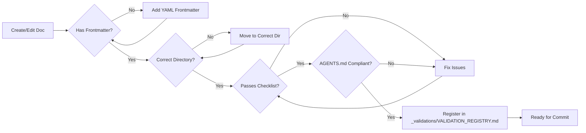

# Agent Context: Root Directory

## Overview

This repository, `doc-llm-ready`, is a framework for creating and maintaining "LLM-ready" documentation. The goal is to ensure all technical knowledge is structured for both human readability and optimal machine ingestion (DevAgents, RAG, automated reasoning).

## Core Principles for Agents

1. **Mermaid-First**: NEVER use binary image files for diagrams. ALWAYS use Mermaid syntax inline.
2. **Metadata-Standard**: Every technical documentation asset MUST have YAML frontmatter. Refer to `conventions/metadata-standard.md`. (Note: `AGENTS.md` files are exempt).
3. **Customer-Agnostic**: Ensure no proprietary or sensitive data is included.
4. **Structured & Declarative**: Use short sentences, clear hierarchies, and prioritize structure over prose.
5. **Document Size Limit**: Documents exceeding **12,000 tokens (~800 lines)** MUST be split into smaller, focused documents. This ensures optimal LLM ingestion, RAG performance, and maintainability.

## Repository Map

- `/docs`: The primary knowledge base, categorized by document type.
- `/conventions`: Rules, styles, and standards that govern this repository.
- `/templates`: Starting points for new documents.
- `/indexes`: Navigation indexes by technology, audience, and topic.
- `/_validations`: Validation system for PR reviews and compliance tracking.

## Critical Files

- `README.md`: The main entry point and project mission.
- `conventions/lm-readiness-checklist.md`: The definitive validation source.
- `conventions/directory-guidelines.md`: Purpose and rules for each folder.
- `conventions/technology-taxonomy.md`: Supported technologies and categorization.
- `_validations/VALIDATION_REGISTRY.md`: Central log of all documentation validations performed.
- `_validations/role-pr-reviewer.md`: Role prompt for PR validation (protected).

## Directory-Specific Agents

Each major directory contains its own `AGENTS.md` with contextual instructions. Always read the local `AGENTS.md` before operating in a directory:

| Directory | AGENTS.md Purpose |
|-----------|-------------------|
| `/conventions` | Standards enforcement context |
| `/docs` | Knowledge base routing and quality gates |
| `/templates` | Template selection guidance |
| `/indexes` | Index maintenance rules |
| `/_validations` | PR validation and compliance tracking |

## Multi-Technology Context

This repository contains documentation for multiple technology stacks. When working with documents:

1. Check the `technology_stack` field in frontmatter
2. Apply technology-specific conventions when available
3. Cross-reference related technologies in `integration_points`
4. Consult `conventions/technology-taxonomy.md` for categorization

### Technology-Specific Guidelines

| Technology | Special Considerations |
|------------|------------------------|
| MuleSoft | Use DataWeave for transformations, reference Anypoint docs |
| AWS | Include ARN patterns, IAM considerations |
| Azure | Include resource naming, RBAC patterns |
| Kubernetes | Include YAML manifests, helm chart references |
| Python | Follow PEP-8, include type hints in examples |
| Java | Follow standard naming conventions, include Maven/Gradle configs |

## Agent Instructions

- **Continuous Improvement**: In every interaction, proactively identify at least one element that does not fully comply with the repository's standards and propose a fix to ensure continuous improvement.
- When creating new content, always consult `/templates` first.
- Before suggesting a commit, validate the document against `conventions/lm-readiness-checklist.md`.
- Ensure all cross-references are relative paths.
- When unsure about document placement, consult `conventions/directory-guidelines.md`.

## Mandatory Validation and Registry

**Every documentation change MUST be validated and registered.**

### Validation Requirements

1. **Automatic Compliance Check**: Before any document is considered ready for commit, the agent MUST verify that the content complies with all applicable `AGENTS.md` rules:
   - Root `AGENTS.md` rules (apply to all documents)
   - Directory-specific `AGENTS.md` rules (apply to documents within that directory)

2. **Validation Scope**: The check must verify:
   - Frontmatter compliance (metadata-standard)
   - Mermaid-first diagram policy
   - Customer-agnostic content
   - Structured and declarative writing style
   - Technology-specific guidelines (if applicable)
   - Directory-specific rules from local `AGENTS.md`
   - **Document size limit** (max 12,000 tokens / ~800 lines)

3. **Registry Entry**: Upon successful validation, the agent MUST record the validation in `_validations/VALIDATION_REGISTRY.md` with:
   - Document path
   - Document version (from frontmatter `version` field)
   - Validation date (ISO 8601 format)
   - AGENTS.md files applied (root + directory-specific)
   - Validation result (PASS/FAIL)
   - Orchestrator used (e.g., Claude Code, Cursor, Windsurf)
   - Model used (e.g., claude-opus-4.5, claude-sonnet-4)

### Registry Format

Entries in `_validations/VALIDATION_REGISTRY.md` must follow this structure:

```markdown
| Document | Version | Date | Applied Rules | Result | Orchestrator | Model |
|----------|---------|------|---------------|--------|--------------|-------|
| docs/guides/example.md | 1.0.0 | 2025-01-03 | root, docs | PASS | Claude Code | claude-opus-4.5 |
```

### Version Tracking

- Each validation is tied to a specific document version
- If a document is updated (new version), it MUST be re-validated
- Historical validation entries are preserved for audit purposes
- The registry serves as a changelog of compliance over time

### Validation Failure Handling

If validation fails:
1. Do NOT register a PASS entry
2. Document the specific rule violations
3. Fix the issues before re-validating
4. Only register after all checks pass

## Prohibited Actions

**NEVER perform these actions autonomously:**

| Action | Reason |
|--------|--------|
| `git commit` | Commits must be made by humans only |
| `git push` | Pushing must be made by humans only |
| `git merge` | Merges require human approval |
| Delete files without explicit request | Prevents accidental data loss |
| Include real keys/passwords/secrets | Use masked placeholders only: `<API_KEY>`, `****`, `${SECRET}` |

Agents may prepare changes and validate them, but the final commit decision belongs to the human operator.

## Validation Workflow



