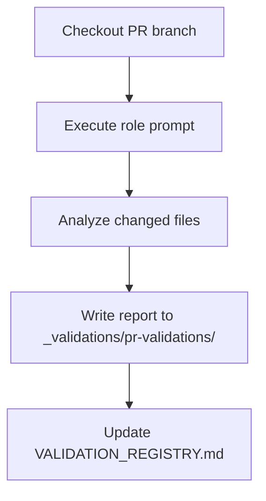

# Validation System

## Purpose

This directory centralizes the entire quality validation system for the doc-llm-ready repository.

## Structure

```
_validations/
  README.md                 # This file
  AGENTS.md                 # Agent context for validation tasks
  role-pr-reviewer.md       # Protected role prompt for PR validation
  VALIDATION_REGISTRY.md    # Historical log of all validations
  pr-validations/           # Individual PR validation reports
```

## Validation Types

### 1. PR Validation (Pre-merge)

Mandatory before merging any documentation PR.

| Aspect | Details |
|--------|---------|
| Executor | Any reviewer with access to the role prompt |
| Output | `pr-validations/PR<NUM>_validation_<YYYYMMDD_hhmmss>_<MODEL>.md` |
| Approval criteria | Score >= 75 |
| Traceability | Model identified in filename and frontmatter |

### 2. Document Validation (Post-commit)

Compliance record for already-merged documents.

| Aspect | Details |
|--------|---------|
| Executor | Automatic or manual |
| Output | Entry in VALIDATION_REGISTRY.md |

## How to Run a PR Validation

### Prerequisites

- `gh` CLI installed and authenticated
- Access to the doc-llm-ready repository
- LLM agent configured (Claude Code, Cursor, Windsurf, etc.)
- Be on the PR branch you want to validate

### Step by Step

1. Open the agent in the repository directory

2. Load the role prompt using one of these options:

**Option A - Direct reference:**
```
@_validations/role-pr-reviewer.md Review PR #<NUMBER>
```

**Option B - Explicit instruction:**
```
Read the role prompt at _validations/role-pr-reviewer.md and use it to validate PR #<NUMBER>
```

**Option C - Copy/paste the role:**
```
[Paste role prompt content]

Now validate PR #<NUMBER>
```

3. The agent generates the report in `_validations/pr-validations/`

4. Review the report and verdict

5. Based on the verdict:
   - **APPROVE** (score >= 75): PR ready to merge
   - **REQUEST_CHANGES**: Contributor must fix and re-validate

### Complete Example

```
# In Claude Code, Cursor, or similar:

@_validations/role-pr-reviewer.md

Review PR #42 from doc-llm-ready
```

The agent will generate something like:
```
_validations/pr-validations/PR42_validation_20250113_153045_claude-opus-4-5.md
```

## How It Works Internally



**Key point:** The role prompt file (`role-pr-reviewer.md`) is protected by CODEOWNERS and must never be modified.

## Security Notes

- `role-pr-reviewer.md` controls how all PRs are validated and must never be modified
- Core validation files are protected by CODEOWNERS (require @mblua-phi approval)
- Validation reports in `pr-validations/` are open for contribution
