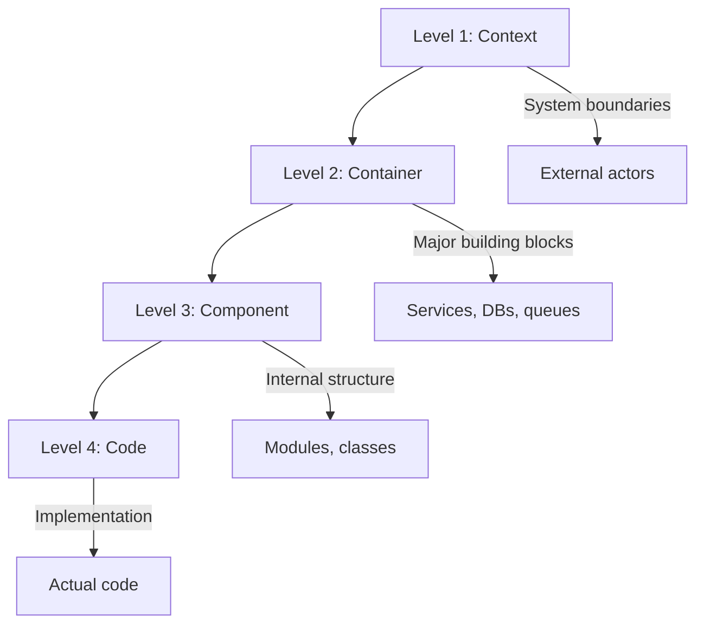

# Agent Context: /docs/architectures

## Purpose

High-level system designs and architectural blueprints. Documents here describe how systems are structured and why.

## Document Characteristics

| Aspect | Requirement |
|--------|-------------|
| Focus | System-level view |
| Diagrams | Multiple levels (C4 recommended) |
| Decisions | Documented with rationale |
| Trade-offs | Explained and justified |

## Agent Responsibilities

1. **Diagrams**: Require multi-level architecture diagrams
2. **Decisions**: Document architectural decisions (ADR format)
3. **Trade-offs**: Explain why alternatives were rejected
4. **Scalability**: Address growth considerations

## Required Sections

Every architecture document must include:

```
1. System Context
2. Container Diagram
3. Component Interactions
4. Data Flow
5. Non-Functional Requirements
6. Architectural Decisions (ADRs)
7. Trade-offs and Alternatives
8. Evolution Roadmap
9. Change Log
```

## Diagram Levels (C4 Model)



## Architectural Decision Record (ADR) Format

```markdown
### ADR-001: [Decision Title]

**Status:** [Proposed | Accepted | Deprecated | Superseded]

**Context:** What is the issue motivating this decision?

**Decision:** What is the change that we're proposing?

**Consequences:** What becomes easier or harder as a result?
```

## Template

New architecture docs should use `templates/architecture-template.md`

## Non-Functional Requirements

Document these aspects:

- **Performance**: Response times, throughput
- **Scalability**: Horizontal/vertical scaling strategy
- **Availability**: SLA, redundancy approach
- **Security**: Authentication, authorization, encryption
- **Maintainability**: Modularity, testability

