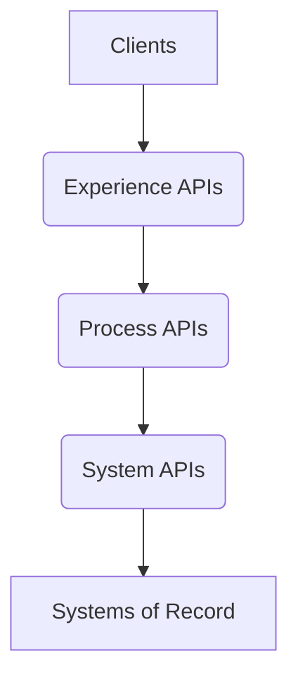

# MuleSoft API Development Best Practices

## 1. Introduction

Developing robust and scalable APIs in MuleSoft requires adherence to best practices across the entire API lifecycle. This document provides guidelines for designing, implementing, securing, and deploying MuleSoft APIs, ensuring they are efficient, maintainable, and aligned with enterprise standards.

## 2. API Design Principles

Effective API design is crucial for usability and long-term success.

### 2.1. RESTful Principles

*   **Resource-Oriented:** Design APIs around resources, not actions. Use nouns for resource paths.
*   **Standard HTTP Methods:** Utilize `GET`, `POST`, `PUT`, `PATCH`, `DELETE` appropriately for CRUD operations.
*   **Statelessness:** Each request from client to server must contain all the information necessary to understand the request.
*   **Clear Naming Conventions:** Use consistent and intuitive naming for resources and parameters (e.g., kebab-case for paths, camelCase for query parameters).

### 2.2. API Led Connectivity

Adopt MuleSoft's API-led connectivity approach, structuring APIs into three layers:

*   **System APIs:** Expose core systems of record, abstracting complexity and providing access to underlying data.
*   **Process APIs:** Orchestrate and combine data from System APIs to create reusable business processes.
*   **Experience APIs:** Tailor data and functionality for specific consumer experiences (web, mobile, partner applications).

## 3. Implementation Best Practices

Efficient and maintainable code is vital for MuleSoft applications.

### 3.1. Modularization and Reusability

*   **Shared Libraries:** Create reusable common components (e.g., error handling, logging, utility flows) as shared libraries or global configurations.
*   **Fragment Projects:** Leverage MuleSoft's concept of API fragments for reusable RAML/OAS components.
*   **Domain-Specific Projects:** Organize projects by domain to promote clear separation of concerns.

### 3.2. Error Handling

Implement a consistent and robust error handling strategy.

*   **Global Error Handler:** Define a global error handler to catch unhandled exceptions and provide a consistent response format.
*   **Specific Error Handlers:** Implement specific error handlers for different error types (e.g., `APIKIT:BAD_REQUEST`, `HTTP:NOT_FOUND`) at the flow or API level.
*   **Custom Error Responses:** Standardize error response payloads (e.g., using a common `error_code`, `message`, `details` structure).

### 3.3. Data Transformation with DataWeave

DataWeave is MuleSoft's powerful transformation language.

*   **Explicit Mappings:** Always define explicit mappings for clarity and maintainability. Avoid `*` selectors in production code.
*   **Type Coercion:** Handle data type conversions explicitly to prevent runtime errors.
*   **Reusable Functions:** Create reusable DataWeave functions for common transformations.
*   **Error Handling in DataWeave:** Utilize `try/catch` blocks within DataWeave for graceful handling of transformation errors.

### 3.4. Logging and Monitoring

Implement comprehensive logging and monitoring for operational visibility.

*   **Standardized Logging:** Use a consistent logging framework and format (e.g., JSON logs) with relevant transaction IDs.
*   **Correlation IDs:** Implement correlation IDs to trace requests across multiple Mule applications and systems.
*   **Monitoring Tools:** Integrate with external monitoring tools (e.g., Anypoint Monitoring, Splunk, ELK Stack) for dashboards and alerts.

## 4. Security Considerations

Security must be embedded throughout the API development process.

### 4.1. API Policies

Apply Anypoint Platform policies for common security requirements.

*   **Client ID Enforcement:** Secure APIs by enforcing client ID and secret.
*   **Rate Limiting:** Protect against abuse and ensure fair usage.
*   **JSON Threat Protection / XML Threat Protection:** Guard against malformed requests.
*   **CORS Policy:** Control cross-origin resource sharing.

### 4.2. Authentication and Authorization

*   **OAuth 2.0 / OpenID Connect:** Implement industry-standard protocols for secure access.
*   **JWT Validation:** Validate JSON Web Tokens (JWT) for identity and permissions.
*   **Role-Based Access Control (RBAC):** Define granular access based on user roles and permissions.

### 4.3. Data Protection

*   **Encryption in Transit:** Use HTTPS/TLS for all communication.
*   **Encryption at Rest:** Ensure sensitive data stored in databases or caches is encrypted.
*   **Data Masking / Tokenization:** Protect sensitive data by masking or tokenizing it where full values are not required.

## 5. Performance Optimization

Optimize APIs for speed and efficiency.

### 5.1. Caching

*   **Object Store Cache:** Utilize MuleSoft's Object Store for in-memory or persistent caching of frequently accessed data.
*   **HTTP Caching:** Implement HTTP caching headers (e.g., `Cache-Control`, `ETag`) for external clients.

### 5.2. Asynchronous Processing

*   **VM Queues:** Use VM queues for asynchronous processing to decouple components and improve responsiveness.
*   **Publish-Subscribe:** Implement publish-subscribe patterns for event-driven architectures.

### 5.3. Bulk Operations

Design APIs to handle bulk operations efficiently when appropriate, reducing the number of individual requests.

## 6. Deployment and Operations

Consider deployment strategies and operational aspects.

### 6.1. CI/CD Integration

*   **Automated Builds:** Integrate MuleSoft projects into a CI/CD pipeline for automated builds and deployments.
*   **Automated Testing:** Include unit, integration, and functional tests in the pipeline.

### 6.2. Environment-Specific Configurations

*   **Configuration Properties:** Use externalized properties (e.g., `config.yaml`, environment variables) for environment-specific settings.
*   **Secure Properties:** Encrypt sensitive configuration values using MuleSoft's secure properties functionality.

## 7. Versioning

Implement a clear API versioning strategy.

*   **URI Versioning:** Include the API version in the URI (e.g., `/api/v1/resource`). This is generally preferred for ease of use.
*   **Header Versioning:** Use custom HTTP headers to specify the API version.
*   **Deprecation Strategy:** Define a clear process for deprecating older API versions.

## 8. Change Log

### Version 1.0.0 - 2026-01-05 - Initial Document Creation
**Sources:**
- MuleSoft official documentation
- Industry best practices for API development
- Claude Code Assistant

