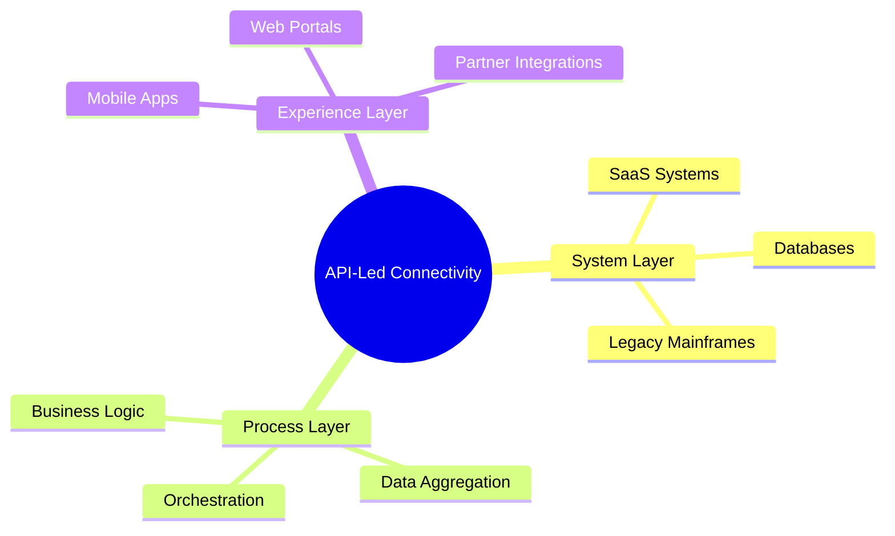
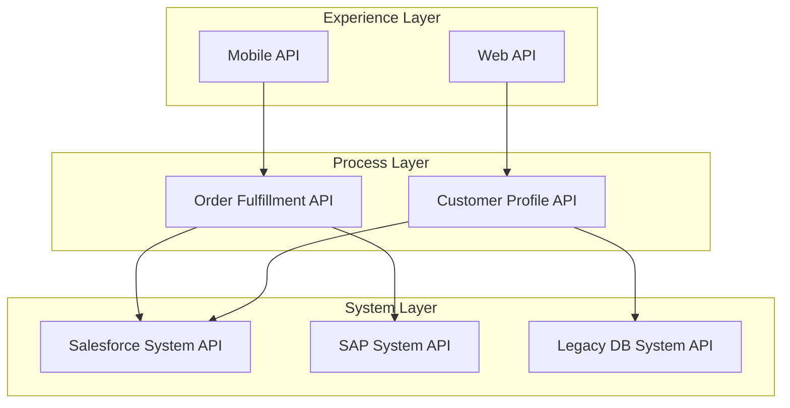

# MuleSoft Application Development Compendium

## Table of Contents

1. [Executive Summary](#1-executive-summary)
2. [The Problem - Integration Sprawl](#2-the-problem---integration-sprawl)
3. [Core Concepts](#3-core-concepts)
   - 3.1 [API-Led Connectivity](#31-api-led-connectivity)
   - 3.2 [Mule Runtime Engine](#32-mule-runtime-engine)
4. [Architecture and Design](#4-architecture-and-design)
   - 4.1 [The Three-Layer Architecture](#41-the-three-layer-architecture)
   - 4.2 [Design Patterns](#42-design-patterns)
5. [Implementation Guide](#5-implementation-guide)
   - 5.1 [Development Workflow](#51-development-workflow)
   - 5.2 [DataWeave Transformations](#52-dataweave-transformations)
   - 5.3 [Testing and Quality](#53-testing-and-quality)
6. [Best Practices](#6-best-practices)
   - 6.1 [Coding Standards](#61-coding-standards)
   - 6.2 [Security Best Practices](#62-security-best-practices)
   - 6.3 [Performance Tuning](#63-performance-tuning)
   - 6.4 [API Development Best Practices](#64-api-development-best-practices)
   - 6.4 [API Development Best Practices](#64-api-development-best-practices)
7. [Reference Materials](#7-reference-materials)
   - 7.1 [API Reference](#71-api-reference)
   - 7.2 [Common Connectors](#72-common-connectors)
8. [MuleSoft and Emerging Technologies: AI & Agent Fabric](#8-mulesoft-and-emerging-technologies-ai--agent-fabric)
   - 8.1 [AI/ML Integration with MuleSoft](#81-aiml-integration-with-mulesoft)
   - 8.2 [Agent Fabric Integration](#82-agent-fabric-integration)
9. [Change Log](#9-change-log)
10. [Appendices](#10-appendices)
    - 10.1 [Appendix A - Architect Audience](#101-appendix-a---architect-audience)
    - 10.2 [Appendix B - Developer Audience](#102-appendix-b---developer-audience)
10. [Appendices](#10-appendices)
    - 10.1 [Appendix A - Architect Audience](#101-appendix-a---architect-audience)
    - 10.2 [Appendix B - Developer Audience](#102-appendix-b---developer-audience)

---

## 1. Executive Summary

### Business Value

MuleSoft provides a unified platform for integration and API management, enabling organizations to connect any application, data, or device. By adopting a structured approach to MuleSoft development, enterprises can reduce integration costs, accelerate time-to-market, and build a more agile digital foundation.

### Technical Overview

The MuleSoft ecosystem revolves around Anypoint Platform and the Mule Runtime. This compendium focuses on the development of "Mule Apps"—lightweight, scalable integration applications built using the Mule SDK and DataWeave.

### Key Benefits

*   **Accelerated Integration**: Out-of-the-box connectors for hundreds of systems.
*   **Reuse and Scalability**: API-led connectivity promotes the reuse of assets across the enterprise.
*   **Unified Management**: Centralized governance, monitoring, and security via Anypoint Platform.

---

## 2. The Problem - Integration Sprawl

### The Fragmentation Challenge

In modern enterprises, data is scattered across hundreds of SaaS applications, legacy systems, and on-premises databases. This fragmentation leads to:

*   **Siloed Data**: Business units cannot easily share information, leading to operational inefficiencies.
*   **Point-to-Point Fragility**: Custom code integrations between systems are difficult to maintain and scale.
*   **Shadow IT**: Teams build their own integrations without central oversight, creating security risks.
*   **Lack of Visibility**: It is nearly impossible to track data flows and API usage across the enterprise.

### The Solution: API-Led Connectivity

MuleSoft addresses these challenges by promoting an API-led approach that decouples systems and provides a unified platform for management and orchestration.

---

## 3. Core Concepts

### 2.1 API-Led Connectivity

API-led connectivity is a methodical way to connect data and applications through reusable and purposeful APIs. These APIs are developed in three layers:

*   **System APIs**: Unlock data from core systems of record.
*   **Process APIs**: Orchestrate data and business logic across systems.
*   **Experience APIs**: Deliver data in the format required by the end-user or application.



### 2.2 Mule Runtime Engine

The Mule Runtime is the engine that executes Mule applications. It is a lightweight, Java-based enterprise service bus (ESB) and integration platform.

---

## 4. Architecture and Design

### 4.1 The Three-Layer Architecture

The API-led connectivity model is implemented through three distinct layers:

#### System Layer
System APIs provide a means of accessing underlying systems of record and exposing data in a standardized way. They mask the complexity of the underlying systems (e.g., SOAP, fixed-width files, proprietary APIs).

#### Process Layer
Process APIs take the data from System APIs and apply business logic, orchestration, and aggregation. They represent the "how" of the integration.

#### Experience Layer
Experience APIs are the means by which data is consumed by its end-users (e.g., mobile apps, web portals). They reformat data for specific consumption needs.



### 4.2 Design Patterns

For a detailed list and explanation of MuleSoft design patterns, please refer to the [MuleSoft Design Patterns](design-patterns.md) document.

---

## 5. Implementation Guide

To accelerate the creation of new APIs, you can use the [MuleSoft API-led Application Blueprint Template](../../../templates/mulesoft-api-led-app-template.md) which provides a structured starting point for AI-assisted generation.

### 5.1 Development Workflow

1.  **Design**: Use API Designer to create RAML or OAS specifications.
2.  **Develop**: Import the API specification into Anypoint Studio and implement the flows.
3.  **Test**: Use MUnit for unit testing and functional testing.
4.  **Deploy**: Deploy to CloudHub, RTF, or On-Premises runtimes.

### 5.2 DataWeave Transformations
### 5.2 DataWeave Transformations

DataWeave is the primary transformation language in MuleSoft. It is a functional language designed for high-performance data processing.

#### Complex Transformation Example

```dataweave
%dw 2.0
output application/json
var exchangeRate = 1.1
---
{
    orders: payload.items map (item, index) -> {
        id: item.id,
        desc: upper(item.name),
        priceUSD: item.price * exchangeRate,
        status: if (item.stock > 0) "IN_STOCK" else "OUT_OF_STOCK"
    },
    totalItems: sizeOf(payload.items),
    totalValue: sum(payload.items.price) * exchangeRate
}
```

### 5.3 Testing and Quality

Comprehensive testing is essential for enterprise-grade MuleSoft applications. For detailed standards on unit testing (MUnit) and functional testing (Karate), refer to the [MuleSoft Testing and Quality Guide](testing-guide.md).

---

## 6. Best Practices

### 6.1 Coding Standards

*   **Naming Conventions**: Use camelCase for variables and kebab-case for flow names.
*   **Modularization**: Break down complex flows into sub-flows and private flows.
*   **Error Handling**: Implement global error handlers and specific error handlers for critical components.

### 6.2 Security Best Practices

*   **Credential Management**: Use secure properties (encrypted) for all sensitive data.
*   **TLS/SSL**: Always use HTTPS for API endpoints.
*   **Policies**: Apply standard policies (OIDC, Rate Limiting, IP Whitelisting) in API Manager.

### 6.3 Performance Tuning
### 6.3 Performance Tuning

*   **Streaming**: Use streaming for large payloads to avoid memory issues.
*   **Batch Processing**: Use the Batch job for processing large volumes of records asynchronously.
*   **Caching**: Implement the Cache scope for frequently accessed, static data.

### 6.4 API Development Best Practices

For comprehensive guidelines on developing robust and scalable APIs with MuleSoft, refer to the [MuleSoft API Development Best Practices](api-best-practices.md) document.

### 6.4 API Development Best Practices

For comprehensive guidelines on developing robust and scalable APIs with MuleSoft, refer to the [MuleSoft API Development Best Practices](../patterns/mulesoft-api-development-best-practices.md) document.

---

## 7. Reference Materials
## 7. Reference Materials

### 7.1 API Reference
### 7.1 API Reference

Refer to the official [MuleSoft Documentation](https://docs.mulesoft.com/) for detailed API specifications.

### 7.2 Common Connectors
### 7.2 Common Connectors

*   **HTTP Connector**: For making and receiving REST/SOAP calls.
*   **Database Connector**: For interacting with relational databases.
*   **Salesforce Connector**: For integrating with Salesforce CRM.

---

## 8. MuleSoft and Emerging Technologies: AI & Agent Fabric

### 8.1 AI/ML Integration with MuleSoft

MuleSoft serves as a powerful integration layer for incorporating Artificial Intelligence (AI) and Machine Learning (ML) capabilities into enterprise applications. It enables organizations to connect to, orchestrate, and leverage various AI/ML services.

Key integration points and use cases include:

*   **Connecting to Cognitive APIs**: Integrate with cloud-based AI services such as natural language processing (NLP), image recognition, sentiment analysis, and recommendation engines (e.g., Google AI Platform, Azure Cognitive Services, AWS AI Services).
*   **Orchestrating ML Model Inferences**: Invoke and manage custom or pre-trained machine learning models hosted on platforms like TensorFlow Serving, Sagemaker, or MLflow to perform real-time predictions and classifications.
*   **Data Pre-processing and Post-processing**: Utilize DataWeave for efficient transformation, cleansing, and enrichment of data before it's fed into AI/ML models, and for formatting model outputs for downstream consumption.
*   **AI-Driven Decision Making**: Embed AI/ML-driven insights directly into business processes, allowing Mule applications to make intelligent routing, approval, or personalization decisions.
*   **Real-time Prediction Services**: Build high-performance API endpoints that expose ML models for real-time inference, enabling immediate responses based on incoming data.
## 8. MuleSoft and Emerging Technologies: AI & Agent Fabric

### 8.1 AI/ML Integration with MuleSoft

MuleSoft serves as a powerful integration layer for incorporating Artificial Intelligence (AI) and Machine Learning (ML) capabilities into enterprise applications. It enables organizations to connect to, orchestrate, and leverage various AI/ML services.

Key integration points and use cases include:

*   **Connecting to Cognitive APIs**: Integrate with cloud-based AI services such as natural language processing (NLP), image recognition, sentiment analysis, and recommendation engines (e.g., Google AI Platform, Azure Cognitive Services, AWS AI Services).
*   **Orchestrating ML Model Inferences**: Invoke and manage custom or pre-trained machine learning models hosted on platforms like TensorFlow Serving, Sagemaker, or MLflow to perform real-time predictions and classifications.
*   **Data Pre-processing and Post-processing**: Utilize DataWeave for efficient transformation, cleansing, and enrichment of data before it's fed into AI/ML models, and for formatting model outputs for downstream consumption.
*   **AI-Driven Decision Making**: Embed AI/ML-driven insights directly into business processes, allowing Mule applications to make intelligent routing, approval, or personalization decisions.
*   **Real-time Prediction Services**: Build high-performance API endpoints that expose ML models for real-time inference, enabling immediate responses based on incoming data.

### 8.2 Agent Fabric Integration

Agent Fabric provides a framework for building and deploying intelligent agents that can interact with various systems and execute complex tasks. MuleSoft plays a crucial role as the integration backbone for Agent Fabric, facilitating seamless communication and data exchange between agents and enterprise applications.

Key aspects of Agent Fabric integration with MuleSoft:

*   **Integration Layer for Agents**: MuleSoft APIs can expose enterprise data and services to intelligent agents, allowing them to access necessary information and trigger actions within existing systems.
*   **Orchestration of Agent Workflows**: Mule flows can orchestrate multi-agent interactions or integrate agent-driven decisions into broader business processes, ensuring coordinated execution.
*   **Event-Driven Architectures**: Leverage MuleSoft's event-driven capabilities to react to events generated by agents, enabling real-time responses and dynamic adjustments to workflows.
*   **Data Exchange Patterns**: Implement robust patterns for data transfer between MuleSoft and Agent Fabric, ensuring data consistency and reliability.

For a deeper understanding of Agent Fabric concepts and architecture, refer to the [Agent Fabric Compendium](../compendiums/agent-fabric-compendium.md) document.

---

## 9. Change Log
## 9. Change Log

### Version 1.0.0 - 2026-01-05 - Initial version
**Sources:**
- MuleSoft official documentation
- Enterprise integration patterns
- AI Assistant (Cursor)

---

*This compendium provides a comprehensive foundation for building robust and scalable MuleSoft applications.*

## 10. Appendices

### 10.1 Appendix A - Architect Audience

*   High-level design patterns.
*   Scaling strategies.
*   Governance frameworks.

### 10.2 Appendix B - Developer Audience

*   Detailed DataWeave examples.
*   MUnit testing strategies.
*   CI/CD pipeline configuration.

---
## 10. Appendices

### 10.1 Appendix A - Architect Audience

*   High-level design patterns.
*   Scaling strategies.
*   Governance frameworks.

### 10.2 Appendix B - Developer Audience

*   Detailed DataWeave examples.
*   MUnit testing strategies.
*   CI/CD pipeline configuration.

---
