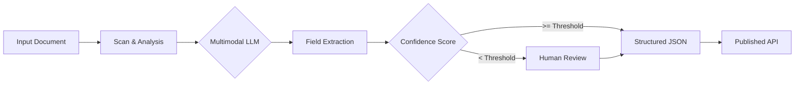
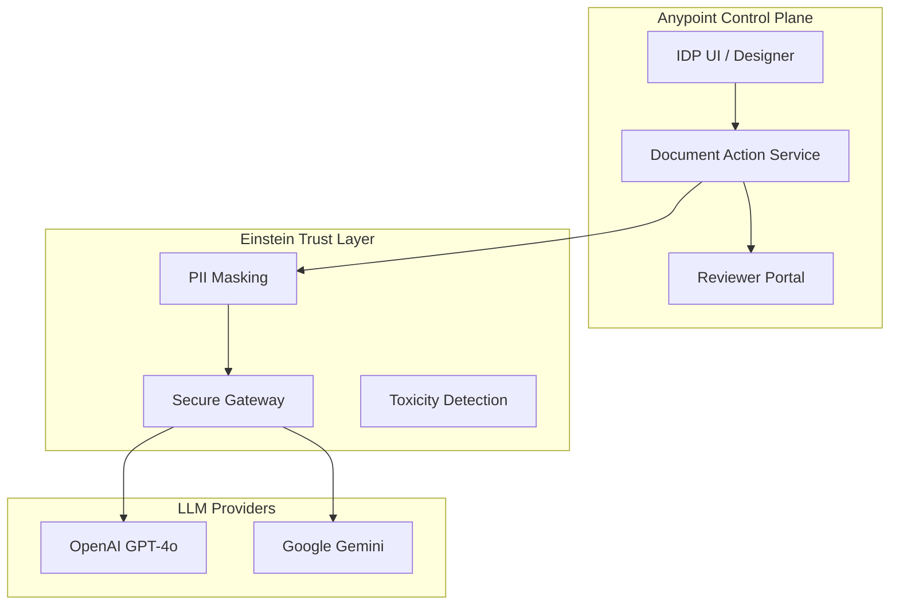

# Complete Guide to MuleSoft Intelligent Document Processing (IDP)

**Document Version:** 1.0.0  
**Last Updated:** January 2026  
**Source:** [MuleSoft IDP Documentation](https://docs.mulesoft.com/idp/)

---

## 1. Executive Summary

MuleSoft Intelligent Document Processing (IDP) represents a paradigm shift in how enterprises handle unstructured data. By combining traditional NLP with multimodal Large Language Models (LLMs) via Einstein AI, IDP enables the transformation of invoices, purchase orders, and custom forms into actionable structured data without complex OCR coding.

### 1.1 Business Value

- **Operational Efficiency**: Reduces manual data entry by up to 80% through automated extraction.
- **Improved Accuracy**: Minimizes human error with AI-driven validation and confidence scores.
- **Fast Time-to-Value**: No-code interface and pre-built models for common document types.
- **Secure AI**: Built on the Salesforce Einstein Trust Layer, ensuring customer data is never used for model training.

### 1.2 Technical Overview

MuleSoft IDP is a cloud-native service within Anypoint Platform that provides:

- **Multimodal Processing**: Interprets both text and visual elements (signatures, stamps, layouts).
- **Native Integration**: Seamlessly connects with Mule apps, RPA bots, and Salesforce flows via auto-generated APIs.
- **Human-in-the-loop**: Integrated review workflows for low-confidence extractions.

---

## Table of Contents

1. [Executive Summary](#1-executive-summary)
2. [Fundamental Concepts](#2-fundamental-concepts)
3. [Architecture and Design](#3-architecture-and-design)
4. [IDP Permissions](#4-idp-permissions)
5. [Main Capabilities](#5-main-capabilities)
6. [Document Actions](#6-document-actions)
7. [Configuration with Natural Language Prompts](#7-configuration-with-natural-language-prompts)
8. [Confidence Score System](#8-confidence-score-system)
9. [Analysis with Custom Schemas](#9-analysis-with-custom-schemas)
10. [Enhanced Extraction with Einstein](#10-enhanced-extraction-with-einstein)
11. [Supported Models](#11-supported-models)
12. [Configuration and Settings](#12-configuration-and-settings)
13. [Publishing and Integration](#13-publishing-and-integration)
14. [Automation Credits](#14-automation-credits)
15. [Privacy and Security](#15-privacy-and-security)
16. [Use Cases](#16-use-cases)
17. [Appendices](#17-appendices)
18. [Reference Materials](#18-reference-materials)
19. [Change Log](#19-change-log)

---

## 2. Fundamental Concepts

### 2.1 Document Action

A **document action** is a multi-step process that uses multiple AI engines to:

1. **Scan** a document
2. **Filter** specific fields
3. **Return** a structured response as a JSON object

Each document action defines:

- **Expected document types** as input
- **Fields to extract** from the document
- **Fields to filter** from the response

### 2.2 Processing Flow

The typical processing flow in IDP is illustrated below:



### 2.3 Structured Response

IDP transforms unstructured documents into structured responses in JSON format, facilitating:

- Integration with external systems
- Automated processing
- Database storage
- Subsequent data analysis

---

## 3. Architecture and Design

The MuleSoft IDP architecture is built on the Anypoint Platform control plane, leveraging the Salesforce Einstein Trust Layer for secure AI processing.

### 3.1 System Architecture



### 3.2 Security and Trust Layer

The Salesforce Einstein Trust Layer is a critical component of IDP, ensuring:

1.  **Data Privacy**: Customer data is never used to train global LLM models.
2.  **Zero Retention**: OpenAI and Google do not retain data sent through the Trust Layer.
3.  **PII Masking**: Sensitive information can be masked before being sent to LLMs.
4.  **Auditability**: Full logging of all AI interactions.

---

## 4. IDP Permissions

To use MuleSoft IDP, you need to have the appropriate permissions configured in Anypoint Platform. IDP permissions are located in Access Management under the **Document Actions** category.

### 4.1 Available Permissions

IDP provides three permission levels that determine what actions you can perform on the platform:

#### 4.1.1 Manage Actions

**Access Level**: Full

**Capabilities**:
- Full access to IDP
- Reviewer permissions assigned by default for every document action
- Complete control over all IDP functionalities

**Recommended Use**: 
- IDP administrators
- Users who need complete control over document actions
- Team managers who supervise multiple document actions

#### 4.1.2 Build Actions

**Access Level**: Development and Publishing

**Capabilities**:
- Create new document actions
- Edit existing document actions
- Publish document actions
- Execute document actions
- Assign reviewers to document actions

**Recommended Use**:
- Document action developers
- Business analysts who configure extractions
- Users who create and maintain document actions

**Limitations**:
- Does not include global administration permissions
- Requires additional reviewer permissions if document review is needed

#### 4.1.3 Execute Published Actions

**Access Level**: Execution

**Capabilities**:
- Execute published document actions
- Retrieve results from document action executions

**Recommended Use**:
- Integrators who consume IDP APIs
- Mule applications that integrate with IDP
- External systems that call IDP APIs
- Users who only need to execute existing document actions

**Limitations**:
- Cannot create, edit, or publish document actions
- Can only execute document actions that are already published

### 4.2 Permissions Matrix

The following table shows what actions are allowed with each permission:


| Action | Manage Actions | Build Actions | Execute Published Actions |
|--------|----------------|---------------|---------------------------|
| Create document actions | ✅ | ✅ | ❌ |
| Edit document actions | ✅ | ✅ | ❌ |
| Publish document actions | ✅ | ✅ | ❌ |
| Execute document actions | ✅ | ✅ | ✅ |
| Retrieve results | ✅ | ✅ | ✅ |
| Assign reviewers | ✅ | ✅ | ❌ |
| Review documents | ✅ | ⚠️* | ❌ |
| Full access to IDP | ✅ | ❌ | ❌ |

*Requires additional reviewer permissions

### 4.3 Permission Configuration

**Location**: Permissions are configured in **Access Management** of Anypoint Platform under the **Document Actions** category.

**Configuration Steps**:
1. Access Anypoint Platform
2. Navigate to **Access Management**
3. Select the **Document Actions** category
4. Assign appropriate permissions to users or roles
5. Save changes

**Best Practices**:
- **Principle of Least Privilege**: Assign only the necessary permissions for each role
- **Separation of Responsibilities**: Use different permissions for developers, executors, and administrators
- **Regular Review**: Periodically review assigned permissions
- **Documentation**: Keep records of what permissions each user has and why

### 4.4 Permissions for Integration

To integrate IDP with other systems through APIs, you need:

**Minimum Permission**: `Execute Published Actions`

**Additional Configuration**:
- Create a Connected App with scope `Execute Published Actions`
- Obtain access token for authentication
- See sections 12.7 and 12.8 for integration details

**Note**: If you already have a connected app configured for IDP, you do not need the **Configure Connected Apps** permission and can use your existing connected app.

### 4.5 Permissions and Connected Apps

When creating a Connected App for integration with IDP:

**Connected App Type**: `App acts on its own behalf (client credentials)`

**Required Scope**: `Execute Published Actions`

**User Permissions**: The user who creates the connected app must have at least the `Execute Published Actions` permission in Anypoint Platform.

**Reference**: For more information on permission management, see [IDP Permissions](https://docs.mulesoft.com/idp/permissions) and [Managing Permissions](https://docs.mulesoft.com/api-manager/managing-permissions) in MuleSoft documentation.

---

## 5. Main Capabilities

### 4.1 Multimodal Processing

IDP supports **multimodal large language models (LLMs)** that can interpret:

- **Text**: Textual content in documents
- **Images**: Visual elements, graphics, signatures, stamps, barcodes
- **Combinations**: Documents that mix text and images

**Advantages of multimodal processing:**

- Processes scanned documents without requiring prior OCR
- Analyzes documents with complex visual elements
- Extracts information from documents that combine multiple formats
- Interprets visual and textual context simultaneously

### 4.2 Simple Interface

The IDP interface is designed to be intuitive and easy to use:

- **Visual Creation**: Create document actions through a graphical interface
- **Guided Configuration**: Step-by-step wizard to configure extractions
- **Preview**: View results before publishing
- **Centralized Management**: Manage all document actions from a single location

### 4.3 No External Services

IDP operates completely within the MuleSoft ecosystem:

- Does not require subscriptions to external OCR or AI services
- All processing is performed within the platform
- Complete control over data and processing
- Cost reduction by eliminating external dependencies

---

## 6. Document Actions

### 5.1 Document Action Types

IDP supports different types of document actions:

#### 5.1.1 Predefined Document Actions

- **Invoice**: Optimized for processing invoices
- **Purchase Order**: Designed for purchase orders

These actions include predefined schemas with common fields for each document type.

#### 5.1.2 Generic Document Actions

- **Generic**: Allows processing any type of document
- **Customize Schema**: Option to fully customize the output schema

### 5.2 Document Action Structure

Each document action contains:

1. **Input Configuration**
   - Accepted document types
   - Supported formats (PDF, images, etc.)
   - Input validations

2. **Field Definition**
   - Fields to extract
   - Expected data types
   - Prompts for each field

3. **Processing Configuration**
   - AI model to use (IDP NLP or Einstein)
   - Validation rules
   - Confidence thresholds

4. **Output Configuration**
   - JSON response structure
   - Fields to include/exclude
   - Data format

5. **Review Configuration**
   - Individual reviewers or teams
   - Confidence thresholds for review
   - Approval workflows

### 5.3 Creating Document Actions

To create a new document action:

1. Access the IDP interface
2. Select "Create New Document Action"
3. Choose the type (Invoice, Purchase Order, or Generic)
4. Configure the extraction schema
5. Define prompts for each field
6. Configure settings and models
7. Test with sample documents
8. Publish as API

---

## 7. Configuration with Natural Language Prompts

### 6.1 What are Prompts?

**Prompts** are natural language questions used to extract specific data from documents. IDP allows you to configure prompts for each field you want to extract.

### 6.2 Prompt Examples

Examples of prompts that can be configured:

- **Questions about amounts:**
  - "What is the subtotal amount?"
  - "What is the grand total?"
  - "What is the highest price?"

- **Questions about dates:**
  - "When is the due date?"
  - "What is the issue date?"
  - "When was the document issued?"

- **Questions about entities:**
  - "Who is the supplier?"
  - "What is the invoice number?"
  - "What is the customer name?"

- **Complex questions:**
  - "What is the total amount due after deducting taxes?"
  - "How many different items are in the invoice?"
  - "What is the total discount applied?"

### 6.3 Advantages of Natural Language Prompts

- **Ease of Use**: Does not require deep technical knowledge
- **Flexibility**: Adaptable to different document types
- **Clarity**: Questions are self-explanatory
- **Maintenance**: Easy to update and modify
- **Collaboration**: Allows business users to participate in configuration

### 6.4 Best Practices for Prompts

1. **Be Specific**: Formulate clear and specific questions
2. **Use Context**: Include context when necessary
3. **Avoid Ambiguity**: Ensure the question has a unique answer
4. **Test Variations**: Test different formulations to optimize results
5. **Document**: Maintain documentation of the prompts used

---

## 8. Confidence Score System

### 7.1 What is the Confidence Score?

The **confidence score** represents the probability that IDP has correctly extracted a value from a document. It is a percentage that indicates the system's level of certainty about the accuracy of the extraction.

### 7.2 Confidence Scale

- **100%**: Extraction with total accuracy - The system is completely certain of the accuracy
- **75%**: 25% probability that the extracted value is incorrect
- **50%**: Medium confidence level - Requires validation
- **Below defined threshold**: Requires mandatory human review

### 7.3 Field-Level Evaluation

Each processed document shows a confidence score **for each extracted field** individually. This allows:

- Identifying specific fields with low confidence
- Prioritizing review on critical fields
- Improving overall processing accuracy

### 7.4 Confidence Threshold

The **confidence threshold** is a configurable value that determines when a document should be sent for human review:

- **Configuration**: Defined in each document action
- **Flexibility**: Can vary according to document type or field
- **Optimization**: Adjustable according to business requirements

### 7.5 Human Review Flow

When the confidence score is below the defined threshold:

1. **Automatic Detection**: IDP identifies fields with low confidence
2. **Sent for Review**: The document is marked for review
3. **Assignment**: Assigned to an individual reviewer or team
4. **Validation**: The reviewer verifies and corrects the extracted values
5. **Approval**: Once validated, the document is fully processed

### 7.6 Reviewer Management

You can add:

- **Individual Reviewers**: Specific users assigned to document actions
- **Review Teams**: Groups of users who can review documents
- **Automatic Distribution**: Automatic assignment based on workload

### 7.7 Benefits of the Confidence System

- **Guaranteed Quality**: Ensures accuracy in data extraction
- **Continuous Learning**: Reviewers can improve the system
- **Error Reduction**: Minimizes errors in complex documents
- **Traceability**: Complete record of reviews and corrections
- **Optimization**: Allows adjusting thresholds according to results

---

## 9. Analysis with Custom Schemas

### 8.1 Generic Document Actions with Custom Schemas

IDP allows you to analyze **any type of document** by creating a Generic document action with the **"Customize Schema"** option enabled.

### 8.2 Customization Capabilities

With custom schemas you can:

#### 8.2.1 Field Definition

- Create custom fields in the output structure
- Define data types for each field
- Set required or optional fields
- Configure specific validations

#### 8.2.2 Table Definition

- Include structured tables in the result
- Define columns and data types
- Configure multiple rows
- Handle nested or complex tables

#### 8.2.3 Instruction Configuration

- Define specific instructions for Einstein
- Configure how to analyze the document
- Specify how to extract data for each field
- Establish custom business rules

### 8.3 Use Cases for Custom Schemas

Custom schemas are ideal for:

- **Non-Standard Documents**: Documents that do not follow predefined formats
- **Specific Business Requirements**: Custom fields according to needs
- **Documents with Complex Structures**: Nested tables or hierarchical structures
- **Specific Integrations**: Output formats required by external systems
- **Regulatory Documents**: Forms with specific compliance requirements

### 8.4 Custom Schema Creation Process

1. **Create Generic Document Action**
   - Select "Generic" type
   - Enable "Customize Schema" option

2. **Design Output Structure**
   - Define main fields
   - Create tables if necessary
   - Establish relationships between fields

3. **Configure Instructions**
   - Write instructions for each field
   - Define specific prompts
   - Configure extraction rules

4. **Test and Refine**
   - Test with sample documents
   - Adjust instructions according to results
   - Optimize output structure

---

## 10. Enhanced Extraction with Einstein

### 10.1 Processing Model Selection

When you add prompts to Invoice or Purchase Order document actions, you can select between two options:

#### 9.1.1 IDP NLP (Default Model)

- **Standard Processing**: Basic natural language processing model
- **Recommended Use**: For documents with standard format and simple extractions
- **Advantages**: Faster and more cost-efficient
- **Limitations**: May have difficulties with complex documents

#### 9.1.2 Einstein

- **Advanced Analysis**: Advanced AI model for complex analysis
- **Recommended Use**: For complex, non-standard documents or those requiring contextual analysis
- **Advantages**: Higher accuracy in complex documents, deep analysis capability
- **Considerations**: May consume more automation credits

### 10.2 Einstein Capabilities

Einstein can answer complex questions that require:

#### 9.2.1 Deep Document Analysis

- Not just field search and extraction
- Complete context understanding
- Interpretation of relationships between elements
- Semantic content analysis

#### 9.2.2 Complex Calculations

Examples of calculations that Einstein can perform:

- "What is the total amount due after deducting taxes and other values?"
- "What is the total discount applied to all items?"
- "What is the average price of the products?"

#### 9.2.3 Contextual Interpretation

- Understand relationships between different elements
- Interpret implicit information
- Recognize patterns and trends
- Extract information from visual and textual context

### 10.3 Recommended Use Cases for Einstein

Einstein is especially useful for:

- **Non-Standard Documents**: Documents that do not use a standard format
- **Hard-to-Read Documents**: Documents with low quality or complex format
- **Driver's Licenses**: Documents with multiple visual elements
- **Medical Certificates**: Documents with uniquely structured information
- **Custom Forms**: Documents with variable or dynamic fields
- **Documents with Calculations**: Documents that require mathematical analysis
- **Multilingual Documents**: Documents in multiple languages

### 10.4 Einstein Configuration

To use Einstein in a document action:

1. Access the document action configuration
2. Select the prompt you want to enhance
3. Choose "Einstein" as the processing model
4. Configure specific instructions if necessary
5. Test with sample documents
6. Adjust according to results

### 10.5 Practical Examples of Einstein Prompts

The following examples show real use cases and Einstein prompts that you can use as a starting point. These examples are based on test data and provide information on how to create prompts to analyze and format custom documents.

**Note**: You can use these examples as a starting point, test them with your documents, and modify them until you obtain the expected result.

> **Example Document Visualization**: Each example includes references to the example documents you can view in the [official MuleSoft documentation](https://docs.mulesoft.com/idp/example-einstein-prompts). These images show the actual documents used to test the prompts and will help you better understand the context of each use case.

#### 9.5.1 Extract Details from a US Driver's License

This example shows how to extract data from an identification document (driver's license) and return the information in structured JSON format.

**Use Case**: Process driver's licenses for identity verification or employee onboarding.

**Example Document**: 
> **Note**: You can view the example document (driver's license) in the [official MuleSoft documentation](https://docs.mulesoft.com/idp/example-einstein-prompts#extract-details-from-a-us-drivers-license). The document shows a California driver's license with all the typical fields that can be extracted.

**Prompt de Einstein**:
```
Identify key elements from the specified document and return them in JSON format.
Do not create new information, provide answers only from the text provided. The JSON format is as follows:
{
    "id_data": {
        "doc_number":<replace with value found for License ID or document ID>,
        "first_name": <replace with the first name of the person in the text>,
        "last_name": <replace with the last name of the person in the text>,
        "issue_date": <replace with the date of issue of this document>,
        "dob": <replace with date of birth found in the text also represented as dob>,
        "exp_date": <replace with expiration date, sometimes written as EXP>,
        "state_region": <replace with state or region where this document was issued>,
        "height": <replace with height specified if not found, say "not found">,
        "class": <replace with vehicle classification if found">,
        "eye_color": <replace with eye color if found">,
        "sex": <sex as specified>,
        "weight": <replace with the weight found>,
        "restrictions":<replace with any restrictions listed in the document>,
        "address": {
            "street": <replace with the street line of the address including any apartment numbers>,
            "city":<replace with the city in the address found>,
            "state": <replace with the state found in the address>,
            "zip": <replace with the zipcode found in the address>
        }
    }
}
```

**Ejemplo de Salida JSON**:
```json
{
  "id_data": {
    "doc_number": "12345678",
    "first_name": "The Genius",
    "last_name": "Einstein",
    "issue_date": "10/30/2024",
    "dob": "03/14/1879",
    "exp_date": "10/31/2031",
    "state_region": "California",
    "height": "5'5\"",
    "class": "D",
    "eye_color": "BROWN",
    "sex": "M",
    "weight": "150 lb",
    "restrictions": "None",
    "address": {
      "street": "707 South Oakland Avenue",
      "city": "Pasadena",
      "state": "CA",
      "zip": "91106"
    }
  }
}
```

**Key Prompt Features**:
- Clearly specifies the expected JSON format
- Instructs not to create new information, only use the provided text
- Handles optional values with clear instructions ("if not found, say 'not found'")
- Hierarchical structure with nested objects for the address

#### 9.5.2 Classify a Document With Multiple Pages

This example demonstrates how to classify content from a multi-page PDF document, identifying different entries on each page.

**Use Case**: Process timesheet summary documents with multiple employee entries, where each page corresponds to a different employee.

**Example Document**: 
> **Note**: You can view the example document (timesheet summary with multiple pages) in the [official MuleSoft documentation](https://docs.mulesoft.com/idp/example-einstein-prompts#classify-a-document-with-multiple-pages). The document shows a multi-page PDF with entries from different employees, where each page contains information for a specific employee.

**Prompt de Einstein**:
```
Classify each page of the following timesheet summary as a unique document type and also identify whether the page continues from the previous document type or it is a new one.
Summarize all the employee's names in the timesheet summary document and the pages where their timesheet entry is found.
Structure the output as a JSON where the employee name is the key and the page number is the value.
```

**Ejemplo de Salida JSON**:
```json
{
    "Jane Almeida": 1,
    "Charles Montes": 2,
    "Albert Vignoli": 3,
    "Max the Mule": 4
}
```

**Key Prompt Features**:
- Handles multi-page documents
- Identifies and classifies content by page
- Structures output as simple key-value pairs
- Useful for documents containing multiple records separated by pages

**Applications**:
- Timesheet processing
- Documents with multiple forms
- Consolidated reports with multiple entries
- Any document where each page represents a different entity

#### 9.5.3 Extract Form Data as Key/Value Pairs Including Handwritten Values

This example shows how to extract data from a medical certificate, including the ability to interpret handwritten text.

**Use Case**: Process medical certificates or medical leave forms that may contain handwritten information.

**Example Document**: 
> **Note**: You can view the example document (medical certificate with handwritten text) in the [official MuleSoft documentation](https://docs.mulesoft.com/idp/example-einstein-prompts#extract-form-data-as-keyvalue-pairs-including-handwritten-values). The document shows a medical leave form with hand-completed fields, demonstrating Einstein's ability to interpret handwritten text.

**Prompt de Einstein**:
```
Analyze this form for a medical leave and extract its values. Don't extract document's title.
Present the data as key-value pairs in a JSON formatted response.
If you find a date, format it as YYYY/MM/DD.
If you find a list of handwritten symptoms, return them as an array and label them "Reason for Absence".
Do not create any facts of information, interpret only the information in the document.
An example output JSON is:
    "Patient_Name": {
        "value": "Paul Grant"
    }
```

**Ejemplo de Salida JSON**:
```json
{
    "Patient_Name": {
      "value": "Paul Grant"
    },
    "Date_of_Birth": {
      "value": "1988/11/02"
    },
    "Case_Number": {
      "value": "12345678"
    },
    "1st_Diagnosed_Date": {
      "value": "2021/04/12"
    },
    "Last_Office_Visit": {
      "value": "2024/09/01"
    },
    "1st_Exam_Date_for_this_Condition": {
      "value": "2021/01/23"
    },
    "Next_Office_Visit": {
      "value": "2024/10/23"
    },
    "Reason_for_Absence": {
      "value": [
        "Unable to complete the TPS reports on Saturday",
        "Hyperventilation during the session"
      ]
    }
}
```

**Key Prompt Features**:
- Specifies consistent date format (YYYY/MM/DD)
- Handles lists as arrays when appropriate
- Includes example of expected format in the prompt
- Explicitly instructs not to create new information
- Can interpret handwritten text thanks to Einstein's multimodal capabilities

**Applications**:
- Medical forms
- Medical leave certificates
- Government forms
- Any form that may contain handwritten text

#### 9.5.4 Best Practices for Creating Einstein Prompts

Based on the previous examples, here are best practices for creating effective prompts:

1. **Specify Output Format**
   - Clearly define the expected JSON structure
   - Include format examples when possible
   - Specify data formats (dates, numbers, etc.)

2. **Clear Instructions on What to Extract**
   - Indicate which fields to extract
   - Specify what to exclude (for example, "Don't extract document's title")
   - Define how to handle missing values

3. **Handling Special Cases**
   - Instructions for optional values
   - How to handle lists or arrays
   - Date and number formats

4. **Prevent Hallucinations**
   - Include explicit instructions: "Do not create new information"
   - "Provide answers only from the text provided"
   - "Interpret only the information in the document"

5. **Test and Refine**
   - Use the examples as a starting point
   - Test with real documents
   - Adjust the prompt according to results
   - Iterate until desired accuracy is achieved

**Reference**: These examples are based on the official MuleSoft documentation. For more information, see [Example Einstein Prompts](https://docs.mulesoft.com/idp/example-einstein-prompts).

---

## 11. Supported Models

### 11.1 Multimodal LLM Models

IDP supports multiple multimodal large language models that can process text and images simultaneously. Each model has different strengths, stability levels, and optimal use cases.

### 11.2 Available Models

IDP supports the following predictive models:

#### 11.2.1 OpenAI GPT-4o (gpt-4o-2024-08-06)

| Attribute | Details |
|-----------|---------|
| **Best For** | Most general tasks, particularly documents in non-Latin languages |
| **Stability** | High |
| **Key Capability** | Can identify font sizes and certain font styles |
| **Image Recognition** | Standard performance with standard credit consumption |
| **Limitation** | Low accuracy when reading checkboxes in forms |

**Recommendation**: Request the model to avoid fabricating information to minimize hallucinations.

**Language Support**: Supports OpenAI's documented language coverage, making it ideal for multilingual document processing.

#### 11.2.2 OpenAI GPT-4o Mini (gpt-4o-mini-2024-07-18)

| Attribute | Details |
|-----------|---------|
| **Best For** | Focused, time-sensitive tasks requiring faster processing |
| **Stability** | High |
| **Characteristic** | Tends toward lazy reasoning patterns |
| **Image Recognition** | Standard performance but consumes higher credits |
| **Limitation** | Low accuracy with form checkboxes |

**Note**: While faster, this model may require more specific prompts due to its tendency toward simpler reasoning approaches.

#### 11.2.3 Google Gemini-2.0 Flash 001

| Attribute | Details |
|-----------|---------|
| **Best For** | Image-heavy documents requiring superior visual analysis |
| **Stability** | Standard |
| **Strength** | Increased image recognition accuracy |
| **Image Recognition** | Medium accuracy on single-page checkbox detection |

**Recommendation**: Choose this model when visual elements are critical to document understanding.

#### 11.2.4 Google Gemini-2.5 Flash

| Attribute | Details |
|-----------|---------|
| **Best For** | Image analysis with enhanced performance over Gemini-2.0 |
| **Stability** | Standard |
| **Strength** | Performs quicker and with higher accuracy than Gemini-2.0 |
| **Image Recognition** | Medium checkbox accuracy for single pages |

**Recommendation**: Preferred choice for image-heavy documents when both speed and accuracy are priorities.

### 11.3 Model Comparison Matrix

| Feature | GPT-4o | GPT-4o Mini | Gemini-2.0 Flash | Gemini-2.5 Flash |
|---------|--------|-------------|------------------|------------------|
| **Stability** | High | High | Standard | Standard |
| **Speed** | Standard | Fast | Fast | Faster |
| **Image Recognition** | Standard | Standard | Enhanced | Enhanced |
| **Checkbox Accuracy** | Low | Low | Medium | Medium |
| **Non-Latin Languages** | Excellent | Good | Good | Good |
| **Credit Consumption** | Standard | Higher | Standard | Standard |
| **Font Analysis** | Yes | Limited | Limited | Limited |

### 11.4 Common Error Scenarios

When models cannot complete processing, IDP provides error handling for scenarios including:

- **Token Limit Issues**: Document content exceeds model context limits
- **Content Flagging**: Content triggers safety filters
- **Response Length Constraints**: Generated response exceeds maximum allowed length

For error handling best practices, implement retry logic with exponential backoff and consider using alternative models when specific errors occur repeatedly.

### 11.5 Model Access

Einstein accesses these models through the **Salesforce Einstein Trust layer**, which is part of the Salesforce Einstein platform. This ensures:

- **Security**: Secure and controlled access to models
- **Governance**: Compliance with enterprise security policies
- **Reliability**: Robust enterprise infrastructure
- **Privacy**: Data protection according to enterprise standards

### 11.6 Model Selection

To select the model to use during document analysis:

1. Access the document action editor
2. Click **Settings**
3. Select the desired model from the available list
4. Save the configuration

### 11.7 Model Selection Considerations

When choosing a model, consider:

- **Document Complexity**: Complex documents may require more advanced models
- **Precision Requirements**: Critical cases may need higher precision models
- **Cost**: More advanced models may consume more credits
- **Speed**: Some models are faster than others
- **Analysis Type**: Simple analyses can use lighter models

### 11.8 Compatibility Note

**Important**: Document actions created before February 5, 2025 support only OpenAI's GPT-4o (gpt-4o-2024-05-13). To enable model selection and the new available models, you need to create a new document action.

---

## 12. Configuration and Settings

### 12.1 Document Action Configuration

Each document action has multiple available configurations:

#### 11.1.1 Settings

Accessible from the document action editor, allows you to configure:

- **Model Selection**: Choose from available models
- **Confidence Thresholds**: Define minimum confidence levels
- **Processing Configurations**: Adjust analysis parameters
- **Output Options**: Configure response format and structure

#### 11.1.2 Field Configuration

- Define which fields to extract
- Configure data types
- Set required or optional fields
- Add custom validations

#### 11.1.3 Review Configuration

- Assign individual reviewers or teams
- Configure confidence thresholds for review
- Establish approval workflows
- Define notifications

### 12.2 Configuration Best Practices

1. **Start Simple**: Begin with basic configurations and refine as needed
2. **Test Extensively**: Test with multiple documents before publishing
3. **Adjust Thresholds**: Optimize confidence thresholds according to results
4. **Document Configurations**: Keep records of configurations and changes
5. **Monitor Results**: Regularly review accuracy and adjust as necessary

---

## 13. Publishing and Integration

### 13.1 Publishing as API

IDP allows you to publish document actions as APIs that can be consumed by various systems.

### 13.2 Systems That Can Consume the APIs

Published APIs can integrate with:

- **RPA Applications**: For robotic process automation
- **Mule Applications**: For integration with other systems through MuleSoft
- **External Systems**: Any system capable of consuming REST APIs
- **Enterprise Applications**: ERP, CRM, management systems, etc.

### 13.3 Advantages of Publishing as API

- **Reusability**: Once published, the API can be consumed by multiple systems
- **Scalability**: Efficient processing of large document volumes
- **Centralized Maintenance**: Updates in one place benefit all consumers
- **Governance**: Centralized control over security and access policies
- **Standards**: Uses REST standards for easy integration

### 13.4 Typical Integration Flow

```
Client System → IDP API → Processing → Validation → JSON Response → Client System
```

### 13.5 RPA Integration Example

1. **RPA captures document**: The RPA bot obtains the document
2. **Sends to IDP**: Calls the IDP API with the document
3. **IDP processes**: IDP extracts structured data
4. **RPA receives response**: Gets data in JSON format
5. **RPA completes process**: Uses the data to complete the automation

### 13.6 Integration Considerations

- **Authentication**: Configure appropriate authentication for APIs
- **Rate Limiting**: Consider speed limits according to expected volume
- **Error Handling**: Implement robust error handling
- **Logging**: Configure logging for monitoring and debugging
- **Versioning**: Consider API versioning for compatibility

### 13.7 Automation with the IDP API

You can automate the data extraction process using the IDP API to integrate your document actions with Mule applications and other systems. Integration with IDP requires creating a connected app, obtaining an access token, and calling the IDP API to execute document actions and retrieve results.

**RPA Alternative**: Instead of calling the IDP API directly, you can use the action steps "Submit Document to MuleSoft IDP" and "Retrieve Results from MuleSoft IDP" from MuleSoft RPA. For more information on RPA integration, see the documentation on [Processing Documents and Retrieving Results With RPA](https://docs.mulesoft.com/idp/automate-document-processing-with-the-idp-api).

#### 12.7.1 Prerequisites

Before you begin, ensure you have the following Anypoint permissions:

- **Execute Published Actions**: Enables a user to execute a published document action and retrieve the results of the execution.

#### 12.7.2 Create a Connected App

To communicate with the IDP API, you need to create a connected app with the following details:

- **Type**: `App acts on its own behalf (client credentials)`
- **Scopes**: `Execute Published Actions`

After creating the connected app, copy its **ID** and **Secret** for further use.

For more information on how to create connected apps, see [Secure API Integration with Connected Apps](https://docs.mulesoft.com/api-manager/secure-api-integration-with-connected-apps).

#### 12.7.3 Obtain the Access Token

After configuring the connected app, use the following `curl` command to get the token:

```bash
curl --location --request POST 'https://anypoint.mulesoft.com/accounts/api/v2/oauth2/token' \
--header 'Content-Type: application/json' \
--data-raw '{
 "grant_type": "client_credentials",
 "client_id": "<connected-app-client-id>",
 "client_secret": "<connected-app-client-secret>"
}'
```

**Important notes**:
- If you are in the EU region, use the domain `eu1.anypoint.mulesoft.com`
- Replace `<connected-app-client-id>` with the Client ID from your connected app
- Replace `<connected-app-client-secret>` with the Client Secret from your connected app

Use the access token obtained when calling the IDP API.

#### 12.7.4 Execute Published Document Actions

After publishing document actions, configuring a connected app, and obtaining the access token, you can call the IDP API to execute your document actions.

**Basic call example**:

```bash
curl --location 'https://idp-rt.{region}.anypoint.mulesoft.com/api/v1/organizations/{orgId}/actions/{actionId}/versions/{actionVersion}/executions' \
--header 'Authorization: Bearer {token}' \
--form 'file=@"{pathToFile}"'
```

**Endpoint parameters**:
- `{region}`: Region of your Anypoint Platform instance
- `{orgId}`: ID of your organization in Anypoint Platform
- `{actionId}`: ID of the published document action
- `{actionVersion}`: Version of the document action to execute
- `{token}`: Access token obtained previously
- `{pathToFile}`: Path to the document file to process

When you query a published document action, IDP uses the model selected in each prompt to extract the data for the corresponding field.

#### 12.7.5 Define a Callback URL

You can define a callback URL when calling IDP to execute your document actions. If defined, IDP will call the callback URL when the document action execution finishes with one of the following states: `SUCCEEDED`, `FAILED`, or `MANUAL_VALIDATION_REQUIRED`.

To specify the callback URL, include the `callback` field in your API call and define a JSON value with the callback URL:

```bash
curl --location 'https://idp-rt.{region}.anypoint.mulesoft.com/api/v1/organizations/{orgId}/actions/{actionId}/versions/{actionVersion}/executions' \
--header 'Authorization: Bearer {token}' \
--form 'file=@"{pathToFile}"' \
--form 'callback="{\"noAuthUrl\":\"{callbackURL}\"}"'
```

**Advantages of using Callback URLs**:
- Asynchronous processing without constant polling
- Automatic notifications when processing finishes
- Better efficiency in high-volume systems

#### 12.7.6 Upload a Base64-Encoded File

You can upload a Base64-encoded file when calling the IDP API to execute your versioned document actions:

```bash
curl --location 'https://idp-rt.{region}.anypoint.mulesoft.com/api/v1/organizations/{orgId}/actions/{actionId}/versions/{actionVersion}/executions' \
--header 'Content-Type: application/json' \
--header 'Authorization: Bearer {token}' \
--data '{
    "file": {yourBase64string},
    "fileName": {testFileName.pdf}
}'
```

**Use cases for Base64**:
- Integration with systems that work with in-memory data
- Document processing from databases
- Workflows that require specific encoding

#### 12.7.7 Use a Different Salesforce Org

If you have multiple Salesforce Orgs connected with your Anypoint Platform organization, you can specify which Org to use when executing your document actions.

To specify a Salesforce Org, add the following header to the API call:

```
x-sfdc-core-tenant-id=<18-char-sfdc-org-id>
```

Replace `<18-char-sfdc-org-id>` with your Salesforce Org ID (18 characters).

**Use cases**:
- Organizations with multiple Salesforce environments
- Data separation between environments (production, development, testing)
- Multi-tenant management

#### 12.7.8 Retrieve the Results of the Execution

After a document action successfully processes a document, or after a reviewer verifies and submits a document queued for review, the results are available for consumption.

When you use the IDP API to execute your document actions, retrieve the results by calling the `/executions` endpoint and providing an `executionId`:

```bash
curl --location \
'https://idp-rt.{region}.anypoint.mulesoft.com/api/v1/organizations/{orgId}/actions/{actionId}/versions/{actionVersion}/executions/{executionId}/v2' \
--header 'Authorization: Bearer {token}'
```

**Parameters**:
- `{executionId}`: Execution ID obtained from the initial API response

#### 12.7.9 Execution Statuses

When you query the results of an execution, the IDP API can return any of the following statuses:

| Status | Description |
|--------|-------------|
| `ACKNOWLEDGED` | The document action execution request was received |
| `IN_PROGRESS` | The execution has started |
| `RESULTS_PENDING` | The execution finished and IDP is processing the results |
| `MANUAL_VALIDATION_REQUIRED` | The execution finished but the results need manual validation |
| `FAILED` | The execution request finished unsuccessfully |
| `PARTIAL_SUCCESS` | The execution request finished but some sub-tasks failed |
| `SUCCEEDED` | The execution request finished successfully |

**Typical Status Flow**:
```
ACKNOWLEDGED → IN_PROGRESS → RESULTS_PENDING → SUCCEEDED
                                              → MANUAL_VALIDATION_REQUIRED
                                              → FAILED
                                              → PARTIAL_SUCCESS
```

**Status Handling**:
- **SUCCEEDED**: Results are ready for consumption
- **MANUAL_VALIDATION_REQUIRED**: Wait for a reviewer to validate and submit the document
- **FAILED**: Review error logs and retry if appropriate
- **PARTIAL_SUCCESS**: Review which fields were extracted successfully and which failed

#### 12.7.10 IDP API Documentation

To confirm the exact endpoints to call to trigger document action executions and retrieve results, see the API documentation. The IDP API documentation is part of the specification and is shown in the API portal after you publish the document actions to Anypoint Exchange.

**Access to Documentation**:
1. Publish your document action in Anypoint Exchange
2. Access the API portal from Exchange
3. Review the complete API specification
4. Use the documented endpoints for integration

**Reference**: For more technical details, see [Processing Documents and Retrieving Results With the API](https://docs.mulesoft.com/idp/automate-document-processing-with-the-idp-api).

### 13.8 Integration with Anypoint Studio

You can execute a published document action and retrieve the results from Anypoint Studio using the **IDP Runtime Service API** connector. This connector is automatically generated when you publish a document action to Anypoint Exchange, and then you can download it as a Mule connector from Exchange.

#### 12.8.1 IDP Runtime Service API Connector Generation

**Version Behavior**:
- Each document action version generates a different connector
- When you publish a document action for the first time, it generates a connector in Exchange that executes version `1.0.0`
- If you modify the document action and republish it as version `1.1.0`, it generates a different connector that you must download and install in Studio to execute this new version
- Consider this behavior when building your integrations

**Connector Operations**:
The IDP Runtime Service API connector includes the following operations:

- **getDocumentActionExecution**: Retrieves the result of a document action execution
- **postDocumentActionExecution**: Submits a document to IDP for processing

#### 12.8.2 Prerequisites

Ensure you have the following Anypoint permissions:

- **Execute Published Actions**: Enables a user to execute a published document action and retrieve the results of the execution

**Note on Connected Apps**: If you already have a connected app configured for IDP, you do not need the **Configure Connected Apps** permission and can use your existing connected app instead of creating a new one.

#### 12.8.3 Create a Connected App

To communicate with the IDP API, create a connected app with the following details:

- **Type**: `App acts on its own behalf (client credentials)`
- **Scopes**: `Execute Published Actions`

After creating the connected app, copy its **ID** and **Secret** for further use.

For more information, see [Secure API Integration with Connected Apps](https://docs.mulesoft.com/api-manager/secure-api-integration-with-connected-apps).

#### 12.8.4 Obtain the Access Token

After configuring the connected app, use the following `curl` command to get the token:

```bash
curl --location --request POST 'https://anypoint.mulesoft.com/accounts/api/v2/oauth2/token' \
--header 'Content-Type: application/json' \
--data-raw '{
 "grant_type": "client_credentials",
 "client_id": "<connected-app-client-id>",
 "client_secret": "<connected-app-client-secret>"
}'
```

**Important notes**:
- If you are in the EU region, use the domain `eu1.anypoint.mulesoft.com`
- Replace `<connected-app-client-id>` with the Client ID from your connected app
- Replace `<connected-app-client-secret>` with the Client Secret from your connected app

#### 12.8.5 Configure the IDP Runtime Service API Connector

Before using the connector operations, configure it by providing the following values, either manually or through a Global Configuration Element:

**Configuration Parameters**:

| Parameter | Description | Example |
|-----------|-------------|---------|
| **host** | Anypoint endpoint URL | `idp-rt.{region}.anypoint.mulesoft.com` |
| **port** | HTTP port for the connection | `443` |
| **basePath** | Base path of the URL to call, without the protocol | - |
| **protocol** | Protocol for the call, in uppercase | `HTTPS` |
| **Response timeout** | Response timeout for this operation | - |
| **clientId** | Client ID of the connected app to call IDP | - |
| **clientSecret** | Client Secret of the connected app to call IDP | - |
| **accessTokenUrl** | URL to obtain the access token for your connected app | `https://anypoint.mulesoft.com/accounts/api/v2/oauth2/token` |

**Global Configuration**:
You can configure these values globally to reuse them across multiple flows, which facilitates maintenance and credential management.

#### 12.8.6 Submit a Document to IDP

Use the **postDocumentActionExecution** operation to send a document to IDP and execute the corresponding document action version.

**Request Configuration**:
Specify the request details in the **Postdocumentactionexecution request data** field of the connector.

**DataWeave Request Example**:

```dataweave
%dw 2.0
output multipart/form-data
---
{
   parts : {
   	 callback : {
   	 	  headers : {
               "Content-Type" : "text/plain"
               },
           content : '{"noAuthUrl": "https://{yourCallbackURL}.com"}'
       },
       file : {
           headers : {
               "Content-Disposition" : {
                   "name": "file",
                   "filename": "{myFile.jpg}",
                   "subtype": "form-data"
                   },
               "Content-Type" : "image/jpg"
               },
           content : payload
           }
       }
}
```

**Request Components**:
- **callback**: (Optional) Callback URL that IDP will call when processing finishes
- **file**: The document file to process with its metadata (name, MIME type)

**Response**:
The response from this operation contains the **execution ID** that you must use to retrieve the execution results.

#### 12.8.7 Retrieve the Results of the Execution

Use the **getDocumentActionExecution** operation to get the results of a document action execution by specifying its execution ID.

**Response Structure**:

The response includes the following structure (example abbreviated for better readability):

```json
{
    "id": "d68e099e-8d37-4188-905a-0eac68b7bf61",
    "documentName": "invoice-1.jpg",
    "status": "SUCCEEDED",
    "pages": [
        {
            "page": 1,
            "fields": {
                "invoiceDate": {
                    "value": "1 June, 1983"
                },
                "invoiceNumber": {
                    "value": "8248"
                }
            },
            "tables": {
                "table1": [
                    {
                        "unitPrice": {
                            "value": ""
                        },
                        "price": {
                            "value": "$ 198.00"
                        }
                    }
                ]
            },
            "prompts": {
                "business": {
                    "prompt": "what is the company main business",
                    "source": "document",
                    "answer": {
                        "value": null
                    }
                }
            }
        }
    ]
}
```

**Response Components**:
- **id**: Unique execution ID
- **documentName**: Name of the processed document
- **status**: Execution status (see section 12.7.9 for possible statuses)
- **pages**: Array of processed pages, each contains:
  - **page**: Page number
  - **fields**: Extracted fields with their values
  - **tables**: Extracted tables (if applicable)
  - **prompts**: Responses to configured prompts

#### 12.8.8 Typical Integration Flow in Studio

**Complete Flow**:

1. **Publish Document Action**: Publish your document action in Anypoint Exchange
2. **Download Connector**: Download the IDP Runtime Service API connector from Exchange
3. **Install in Studio**: Install the connector in Anypoint Studio
4. **Configure Connector**: Configure the connector with your credentials and endpoints
5. **Create Mule Flow**: Create a flow that uses the connector
6. **Send Document**: Use `postDocumentActionExecution` to send the document
7. **Get Execution ID**: Extract the execution ID from the response
8. **Retrieve Results**: Use `getDocumentActionExecution` with the execution ID to get results
9. **Process Results**: Process the extracted data according to your business needs

**Considerations**:
- **Version Management**: Ensure you use the correct connector version that corresponds to your document action version
- **Asynchronous Callbacks**: Consider using callbacks for asynchronous processing instead of polling
- **Error Handling**: Implement robust error handling for statuses such as `FAILED` or `MANUAL_VALIDATION_REQUIRED`
- **Timeouts**: Configure appropriate timeouts according to the size and complexity of your documents

**Reference**: For more details on integration with Anypoint Studio, see [Integrating IDP with Anypoint Studio](https://docs.mulesoft.com/idp/integrating-idp-with-anypoint-studio).

---

## 14. Automation Credits

### 14.1 What are Automation Credits?

**Automation Credits** are the consumption unit used by IDP to process documents. Each processed document consumes a certain amount of credits according to the complexity of the processing.

### 14.2 Factors Affecting Consumption

Credit consumption can vary according to:

- **Document Type**: More complex documents consume more credits
- **Model Used**: More advanced models may consume more credits
- **Number of Fields**: More fields to extract can increase consumption
- **Einstein Usage**: Analysis with Einstein may consume additional credits
- **Analysis Complexity**: More complex analyses require more resources

### 14.3 Credit Management

To efficiently manage credits:

- **Monitor Consumption**: Regularly review credit usage
- **Optimize Configurations**: Adjust configurations to minimize consumption
- **Choose Appropriate Models**: Use lighter models when possible
- **Plan Volumes**: Consider expected volumes when planning

### 14.4 Additional Information

For specific details on Automation Credits consumption and rates, see the official MuleSoft documentation on "Automation Credits Usage and Rates".

---

## 15. Privacy and Security

### 15.1 Data Privacy

**Important Guarantee**: Einstein does not use customer data to train document analysis models in IDP.

### 15.2 Security Implications

This guarantee ensures:

- **Enterprise Data Privacy**: Customer data remains private
- **Regulatory Compliance**: Compliance with data protection regulations (GDPR, CCPA, etc.)
- **Sensitive Information Security**: Protection of confidential and sensitive information
- **Enterprise Trust**: Companies can trust in the secure processing of their documents

### 15.3 Security Best Practices

Additionally, it is recommended:

- **Data Classification**: Classify documents according to sensitivity
- **Access Control**: Implement appropriate access controls
- **Auditing**: Maintain processing audit records
- **Compliance**: Ensure compliance with enterprise policies

---

## 16. Use Cases

### 16.1 Invoice Processing

**Scenario**: Automate invoice data extraction for accounting systems.

**Capabilities Used**:
- Standard field extraction (invoice number, date, total amount)
- Complex calculations with Einstein (total after taxes)
- Validation through confidence scoring
- Integration with ERP systems

**Benefits**:
- Reduction in manual processing time
- Higher accuracy in data extraction
- Automatic integration with accounting systems
- Reduction in human errors

### 16.2 Purchase Order Processing

**Scenario**: Digitize purchase orders received in PDF format or scanned.

**Capabilities Used**:
- Supplier information extraction
- Product and quantity identification
- Price and term validation
- Integration with procurement management systems

**Benefits**:
- Acceleration of the procurement process
- Improved data accuracy
- Integration with approval systems
- Complete process traceability

### 16.3 Non-Standard Documents

**Scenario**: Process custom documents such as licenses, certificates, or unique forms.

**Capabilities Used**:
- Custom schemas
- Einstein analysis for contextual interpretation
- Human review for complex documents
- Custom APIs for integration

**Benefits**:
- Flexibility for any document type
- Processing of unique documents
- Adaptability to specific requirements
- Maintained accuracy in complex documents

### 16.4 RPA Integration

**Scenario**: Automate processes that involve document reading.

**Flow**:
1. RPA captures document
2. Sends to IDP for processing
3. IDP extracts structured data
4. RPA uses data to complete automated process

**Benefits**:
- End-to-end automation
- Reduced human intervention
- Faster processing
- Greater process consistency

### 16.5 Regulatory Document Processing

**Scenario**: Process regulatory forms with specific compliance requirements.

**Capabilities Used**:
- Custom schemas for specific fields
- Validation through confidence scoring
- Human review for critical documents
- Complete processing traceability

**Benefits**:
- Regulatory compliance
- Accuracy in critical documents
- Complete audit trail
- Reduced compliance risks

---

## 17. Appendices

### 17.1 For Architects
- **Scalability**: IDP is a multi-tenant SaaS offering; scale is handled by the platform.
- **Security**: All document data is encrypted at rest and in transit. The Einstein Trust Layer prevents data retention by third-party LLMs.
- **Resilience**: Use Callback URLs for asynchronous processing to avoid timeouts on large documents.

### 17.2 For Developers
- **Mime Types**: Supported formats include `application/pdf`, `image/jpeg`, `image/png`, `image/tiff`.
- **Base64 Limits**: Maximum file size for Base64 upload is 10MB.
- **Error Handling**: Monitor for `MANUAL_VALIDATION_REQUIRED` status to pause downstream processing until human review is complete.

### 17.3 For Business Leaders
- **ROI**: Typical implementation sees positive ROI within 3-6 months.
- **Automation Credits**: Credits are consumed per document execution. Monitor the "Automation" tab in Anypoint Platform for usage metrics.

---

## 18. Reference Materials

### 18.1 Official Documentation

- **Main Page**: [MuleSoft IDP Documentation](https://docs.mulesoft.com/idp/)
- **IDP Permissions**: [IDP Permissions](https://docs.mulesoft.com/idp/permissions) - Complete information on permissions needed to use IDP
- **Getting Started**: Quick start guide with document processing
- **Analysis with Custom Schemas**: Documentation on analysis with custom schemas
- **Analysis with Pre-Built Schemas**: Guide on using pre-built schemas
- **Einstein Prompt Examples**: [Example Einstein Prompts](https://docs.mulesoft.com/idp/example-einstein-prompts) - Practical prompt examples for different use cases
- **Automation with the IDP API**: [Processing Documents and Retrieving Results With the API](https://docs.mulesoft.com/idp/automate-document-processing-with-the-idp-api) - Complete guide on how to use the IDP API to automate document processing
- **Integration with Anypoint Studio**: [Integrating IDP with Anypoint Studio](https://docs.mulesoft.com/idp/integrating-idp-with-anypoint-studio) - Guide to integrate IDP with Mule applications using the IDP Runtime Service API connector
- **Publishing Document Actions**: Documentation on publishing document actions
- **Supported Models**: [Supported Models](https://docs.mulesoft.com/idp/supported-models) - Complete list, capabilities, and limitations of each supported AI model
- **RPA Overview**: Information on RPA integration

### 18.2 Learning Resources

#### 18.2.1 Trailhead

- **MuleSoft IDP Basics**: Trailhead badge with IDP introduction
  - Requires Trailhead login
  - Includes fundamental concepts
  - Practical exercises
  - [Sign up for Trailhead](https://trailhead.salesforce.com/) if you don't have an account

**Badge Content**:
- Introduction to IDP
- Fundamental concepts
- Document action creation
- Prompt configuration
- API publishing
- Practical exercises

### 18.3 Document Action Configuration

For specific details on document action configuration, see:

- **Settings Configuration**: Guide on configuring settings and model selection
- **Feature Availability**: Information on feature availability according to creation date

**Note**: Document actions created before February 5, 2025 have limitations in model selection. See documentation for specific details.

### 18.4 Integration and Development

- **REST APIs**: Documentation on consuming published APIs
- **Mule Integration**: Guides on integrating with Mule applications
- **RPA Integration**: Specific documentation on RPA integration
- **Code Examples**: Implementation examples available in the documentation

### 18.5 Support and Community

- **Help Center**: MuleSoft help center
- **Community Forums**: Community forums for questions and discussions
- **Contact Support**: Options to contact technical support

---

## Conclusion

MuleSoft Intelligent Document Processing (IDP) offers a complete and flexible solution for intelligent document processing. Its multimodal processing capabilities, natural language configuration flexibility, and integration with Einstein for advanced analysis position it as a powerful tool for digitization and automation of business processes.

The ability to publish actions as APIs and native integration with RPA and Mule applications facilitate adoption in existing enterprise environments, while the confidence scoring system and human review ensure the quality and accuracy required in critical business processes.

With support for multiple advanced AI models and the ability to customize schemas for any document type, IDP adapts to a wide variety of enterprise use cases, from standard invoice processing to complex analyses of unstructured documents.

---

## 19. Change Log

| Version | Date | Human Author | Description |
|---------|------|--------------|-------------|
| 1.1.0 | 2026-01-09 | Mariano Blua | Enhanced Supported Models section (11) with detailed model capabilities, limitations, stability levels, and comparison matrix based on official MuleSoft documentation. |
| 1.0.0 | 2026-01-05 | Mariano Blua | Initial LLM-Ready version. Added frontmatter, architecture diagrams, and role-specific appendices. |
| 0.9.0 | 2025-01-05 | Alex Ortega | Initial draft based on MuleSoft documentation. |

---

**End of Document**

**Last Updated**: January 2026  
**Source**: [MuleSoft IDP Documentation](https://docs.mulesoft.com/idp/)

