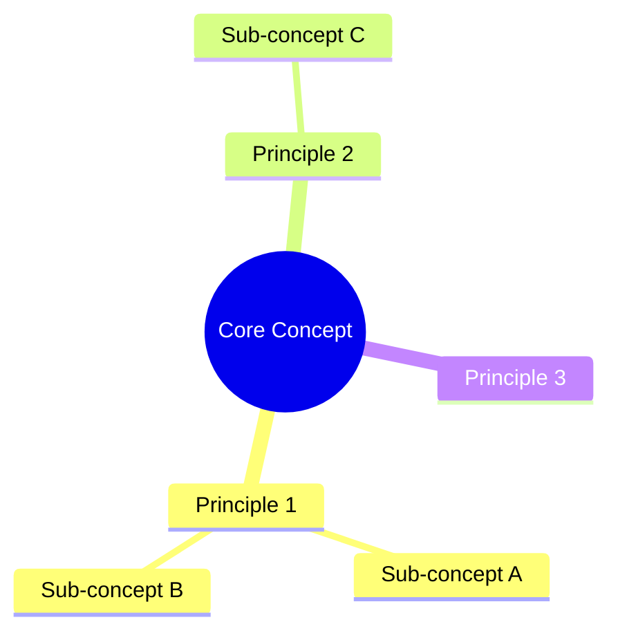

# Agent Context: /docs/concepts

## Purpose

Theoretical foundations and conceptual explanations. Documents here focus on understanding principles, not implementing solutions.

## Document Characteristics

| Aspect | Requirement |
|--------|-------------|
| Focus | Theory and understanding |
| Code | Minimal - only for illustration |
| Diagrams | Conceptual models, mindmaps |
| Audience | Those learning fundamentals |

## Agent Responsibilities

1. **Clarity**: Explain complex ideas simply
2. **Diagrams**: Use mindmaps for concept relationships
3. **Glossary**: Define all technical terms
4. **References**: Link to deeper resources

## Required Sections

Every concept document must include:

```
1. Overview
2. Key Concepts
3. Conceptual Model (Mermaid diagram)
4. How It Works
5. Terminology Glossary
6. Common Misconceptions
7. Further Reading
8. Change Log
```

## Concept vs Pattern vs Compendium

| Aspect | Concept | Pattern | Compendium |
|--------|---------|---------|------------|
| Focus | Theory | Solution | Complete guide |
| Length | Short-medium | Medium | 1000+ lines |
| Code | Minimal | Required | Included |
| Audience | Learning | Implementing | All roles |

## Diagram Style

Use Mermaid mindmaps for concept relationships:



## Template

New concept docs should use `templates/concept-template.md`

## Writing Guidelines

- Define terms before using them
- Use analogies for complex ideas
- Build from simple to complex
- Avoid implementation details
- Link to patterns for "how to implement"

