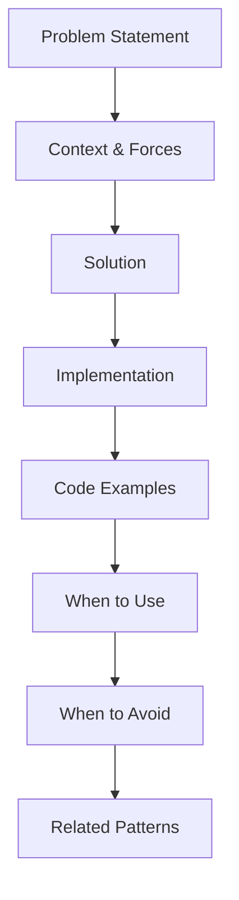

# Agent Context: /docs/patterns

## Purpose

Atomic reusable solution templates and design patterns. Documents in this directory provide proven solutions to specific technical problems. General "Best Practices" or broad guides must be placed in `/compendiums`.

## Document Characteristics

| Aspect | Requirement |
|--------|-------------|
| Format | Strict Problem-solution structure |
| Code | Required - working, not pseudocode |
| Trade-offs | Must analyze when to use/avoid |
| Scope | Focused on a single, reusable solution |

## Agent Responsibilities

1. **Reusability**: Patterns should be technology-agnostic when possible
2. **Completeness**: Include full implementation examples
3. **Context**: Clear problem statement and forces
4. **Testing**: Include validation/testing guidance

## Required Sections

Every pattern document must include:

```
1. Problem Statement
2. Context and Forces
3. Solution Overview (with Mermaid diagram)
4. Implementation Details
5. Code Examples (complete, runnable)
6. When to Use
7. When to Avoid
8. Related Patterns
9. Change Log
```

## Pattern Categories

Organize patterns by category:

```
/patterns/
  /integration/
    api-gateway-pattern.md
    event-driven-pattern.md
  /resilience/
    circuit-breaker-pattern.md
    retry-pattern.md
  /security/
    oauth-flow-pattern.md
    zero-trust-pattern.md
  /data/
    caching-pattern.md
    transformation-pattern.md
```

## Code Example Standards

- Use syntax highlighting with language identifier
- Include complete, runnable examples
- Add inline comments for complex logic
- Test all examples before documenting
- Include both happy path and error handling

```markdown
\`\`\`java
// Example: Circuit Breaker Implementation
public class CircuitBreaker {
    // Full implementation here
}
\`\`\`
```

## Template

New pattern docs should use `templates/pattern-template.md`

## Pattern Document Structure



