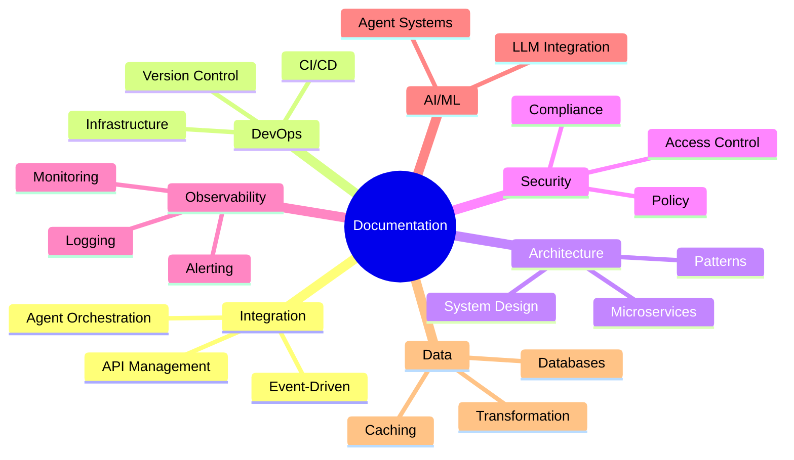

# Documentation Index by Topic

This index organizes documentation by subject matter in a hierarchical structure. Use this to explore related concepts and find documentation by topic area.

---

## Integration & APIs

### Agent Orchestration

- [Agent Fabric Compendium](../docs/compendiums/mulesoft/agent-fabric-compendium.md) - Complete guide to MuleSoft Agent Fabric

### API Management

- [Development Guide](../docs/compendiums/mulesoft/development-guide.md) - Authoritative guide for MuleSoft development lifecycle
- [Testing and Quality](../docs/compendiums/mulesoft/testing-guide.md) - Unit and functional testing standards
- [API Best Practices](../docs/compendiums/mulesoft/api-best-practices.md) - Standards for high-quality MuleSoft API development
- [Design Patterns](../docs/compendiums/mulesoft/design-patterns.md) - Reusable integration patterns for MuleSoft

### Event-Driven Architecture

_No documents yet. Contribute the first!_

---

## DevOps & Automation

### Version Control

- [Repository Configuration](../docs/platforms/github-repo-config.md) - GitHub repo governance setup
- [Branching and Committing](../docs/platforms/github-branching-commiting.md) - Git workflow standards

### CI/CD Pipelines

_No documents yet. Contribute the first!_

### Infrastructure as Code

_No documents yet. Contribute the first!_

---

## Architecture & Design

### System Architecture

_No documents yet. Contribute the first!_

### Design Patterns

_No documents yet. Contribute the first!_

### Microservices

_No documents yet. Contribute the first!_

---

## Security & Governance

### Access Control

_No documents yet. Contribute the first!_

### Compliance

_No documents yet. Contribute the first!_

### Policy Management

_No documents yet. Contribute the first!_

---

## Observability & Operations

### Monitoring

_No documents yet. Contribute the first!_

### Logging

_No documents yet. Contribute the first!_

### Alerting

_No documents yet. Contribute the first!_

---

## AI & Machine Learning

### Agent Systems

- [Agent Fabric Compendium](../docs/compendiums/mulesoft/agent-fabric-compendium.md) - Enterprise agent orchestration
- [IDP Compendium](../docs/compendiums/mulesoft/idp-compendium.md) - Intelligent document processing with Einstein AI

### LLM Integration

_No documents yet. Contribute the first!_

---

## Data & Storage

### Databases

_No documents yet. Contribute the first!_

### Caching

_No documents yet. Contribute the first!_

### Data Transformation

_No documents yet. Contribute the first!_

---

## Topic Hierarchy

---

## How to Add New Entries

When adding a new document:

1. Identify the primary topic area
2. Find or create the appropriate section/subsection
3. Add the document with a brief description
4. Update the mindmap if adding new topic categories

---

## Change Log

### Version 1.0.0 - 2026-01-02 - Initial topic index
**Sources:**
- Repository structure analysis
- Claude Code Assistant
