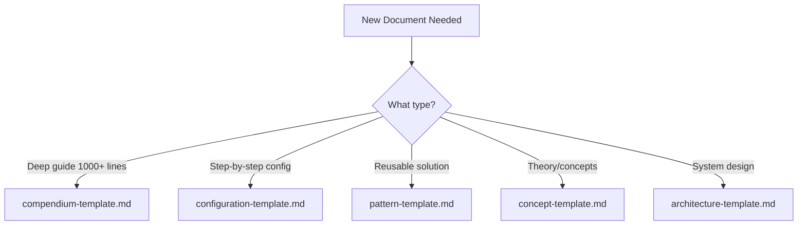

# Agent Context: /templates

## Purpose

Provides the "skeletons" for all new documentation in the repository. These ensure that consistency is "baked in" from the start.

## Agent Responsibilities

1. **Bootstrap**: When asked to create a new document, find the appropriate template here first
2. **Metadata**: Ensure placeholders in the template frontmatter are filled correctly
3. **No Drift**: If a convention changes (in `/conventions`), ensure these templates are updated
4. **Guidance**: Help users select the correct template for their content type

## Template Inventory

| Template | Use For | Target Directory |
|----------|---------|------------------|
| `compendium-template.md` | Deep technical guides (1000+ lines) | `/docs/compendiums` |
| `configuration-template.md` | Platform/tool setup guides | `/docs/platforms` |
| `pattern-template.md` | Reusable solutions | `/docs/patterns` |
| `concept-template.md` | Theoretical foundations | `/docs/concepts` |
| `architecture-template.md` | System designs | `/docs/architectures` |

## Template Selection Guide

## Usage Instructions

1. Copy the raw content of the template to the destination file
2. Replace all placeholder text (marked with `[brackets]`)
3. Fill in YAML frontmatter completely
4. Remove any sections that don't apply (with justification)
5. Add sections specific to your content as needed

## Template Maintenance

When updating templates:

1. Ensure changes align with `/conventions` standards
2. Update the template's internal version comment
3. Update this AGENTS.md if adding new templates
4. Consider migration path for existing documents

## When Creating New Templates

Before adding a new template:

1. Identify gap in existing templates
2. Define required sections based on content type
3. Add guidance comments (`<!-- -->`) in template
4. Include placeholder metadata
5. Add example content where helpful
6. Update this AGENTS.md inventory table

