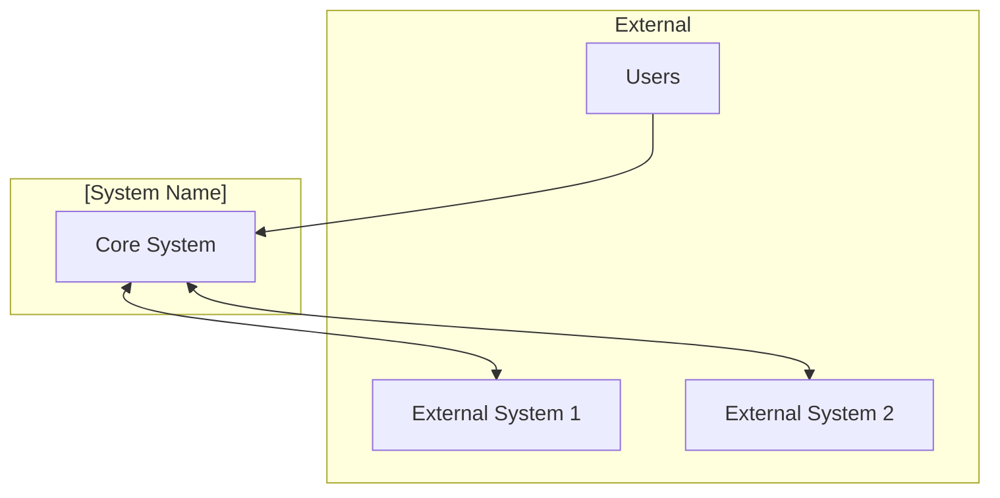
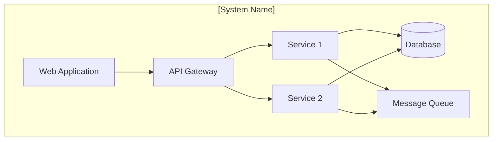
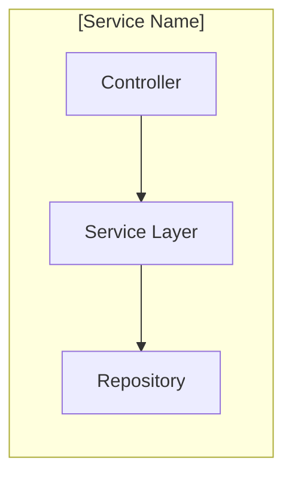
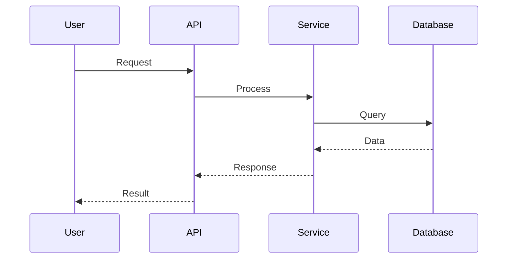
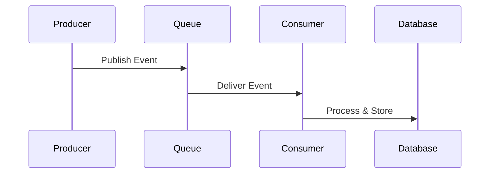

# [System/Architecture Name]

<!--
Template: architecture-template.md v1.0.0
Use for: System designs in /docs/architectures
-->

## 1. Executive Summary

<!--
Brief overview for executive stakeholders.
- What problem does this architecture solve?
- What are the key benefits?
- What is the scope?
-->

[2-3 paragraph summary of the architecture and its value]

## 2. System Context

<!--
Level 1 of C4 model: Show the system in its environment.
Who uses it? What external systems does it interact with?
-->

### 2.1 Context Diagram

### 2.2 External Actors

| Actor | Description | Interaction |
|-------|-------------|-------------|
| [User type] | [Who they are] | [How they interact] |
| [External system] | [What it is] | [Integration type] |

## 3. Container Diagram

<!--
Level 2 of C4 model: Major building blocks.
Applications, databases, message queues, etc.
-->

### 3.1 Container Overview

### 3.2 Container Descriptions

| Container | Technology | Purpose |
|-----------|------------|---------|
| [Container 1] | [Tech stack] | [What it does] |
| [Container 2] | [Tech stack] | [What it does] |
| [Database] | [DB type] | [What data it stores] |

## 4. Component Interactions

<!--
Level 3 of C4 model: Internal structure of containers.
Key components and their responsibilities.
-->

### 4.1 Component Diagram

### 4.2 Key Components

| Component | Responsibility | Dependencies |
|-----------|---------------|--------------|
| [Component 1] | [What it does] | [What it needs] |
| [Component 2] | [What it does] | [What it needs] |

## 5. Data Flow

<!--
Show how data moves through the system.
Include both synchronous and asynchronous flows.
-->

### 5.1 Primary Data Flow

### 5.2 Asynchronous Flows

## 6. Non-Functional Requirements

<!--
Document quality attributes and constraints.
-->

### 6.1 Performance

| Metric | Target | Rationale |
|--------|--------|-----------|
| Response time | < [X] ms | [Why this target] |
| Throughput | [X] req/sec | [Why this target] |

### 6.2 Scalability

| Aspect | Strategy |
|--------|----------|
| Horizontal scaling | [Approach] |
| Vertical scaling | [Approach] |
| Data partitioning | [Approach] |

### 6.3 Availability

| Requirement | Approach |
|-------------|----------|
| Target SLA | [X]% uptime |
| Redundancy | [Strategy] |
| Failover | [Mechanism] |

### 6.4 Security

| Aspect | Implementation |
|--------|----------------|
| Authentication | [Method] |
| Authorization | [Approach] |
| Encryption | [In-transit/at-rest] |

## 7. Architectural Decisions

<!--
Document key decisions using ADR format.
-->

### ADR-001: [First Decision Title]

**Status:** Accepted

**Context:** [What situation required a decision?]

**Decision:** [What was decided?]

**Consequences:**
- [Positive consequence]
- [Negative consequence or trade-off]

### ADR-002: [Second Decision Title]

**Status:** Accepted

**Context:** [What situation required a decision?]

**Decision:** [What was decided?]

**Consequences:**
- [Positive consequence]
- [Negative consequence or trade-off]

## 8. Trade-offs and Alternatives

<!--
Explain why alternatives were rejected.
-->

| Decision | Chosen Option | Alternative | Why Rejected |
|----------|--------------|-------------|--------------|
| [Decision area] | [What we chose] | [What we didn't] | [Reason] |

## 9. Evolution Roadmap

<!--
How might this architecture evolve?
-->

| Phase | Changes | Timeline |
|-------|---------|----------|
| Current | [Current state] | Now |
| Phase 1 | [Planned changes] | [When] |
| Future | [Long-term vision] | [When] |

---

## Change Log

### Version 1.0.0 - YYYY-MM-DD - Initial architecture documentation
**Sources:**
- [Contributor Name]
- [AI Assistant if applicable]
