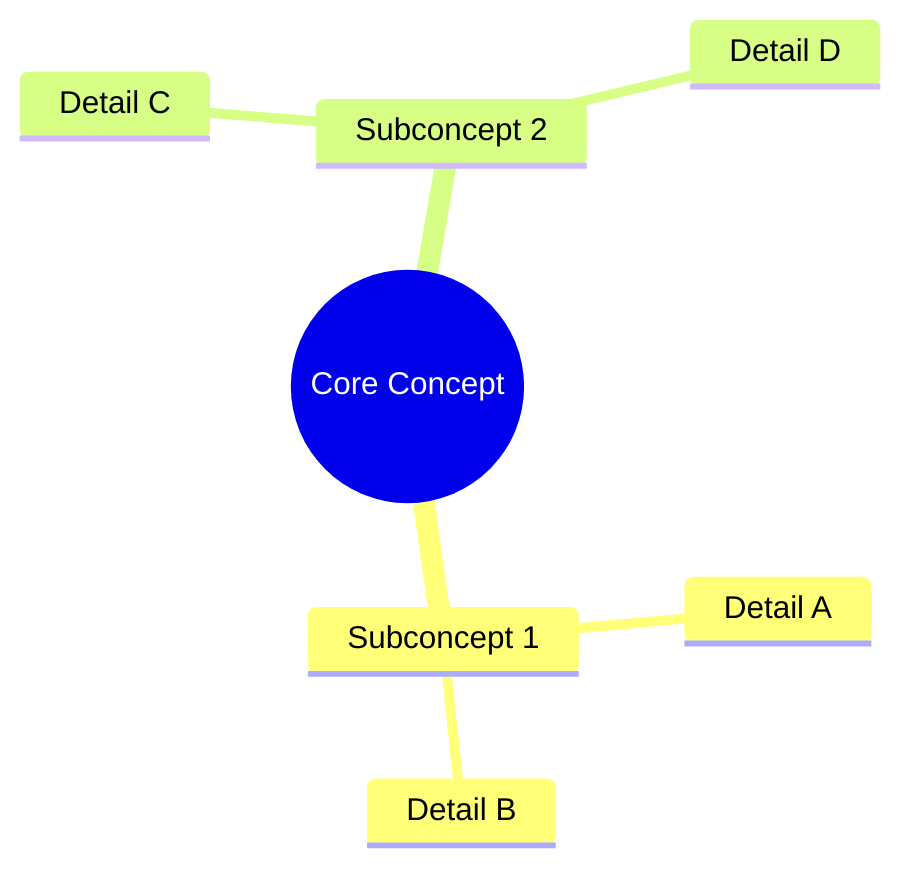
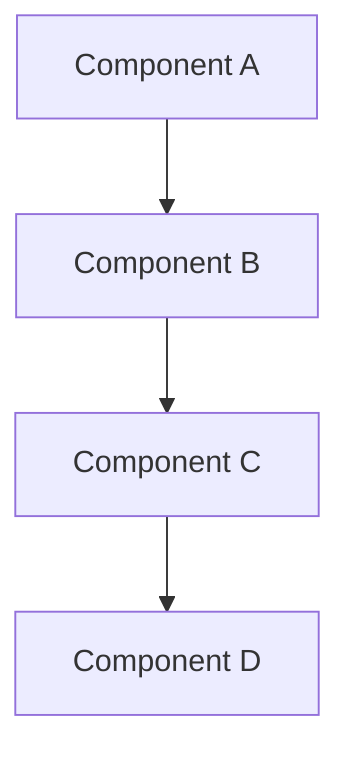

# Compendium Template

**Purpose:** This template provides a standardized structure for comprehensive technical guides in `/docs/compendiums/`. Use this template for deep technical knowledge, multi-audience documentation, and complex domain coverage.

---

```yaml
---
title: [Document Title] Compendium
purpose: [Comprehensive guide covering [domain] for [purpose]]
audience: [[architect, developer, presales, executive]]  # Select appropriate roles
scope: [Complete scope of the technical domain covered]
last_updated: YYYY-MM-DD
version: 1.0.0
keywords: [[keyword1, keyword2, keyword3, keyword4]]
related_docs: [[path/to/related.md]]
---
```

# [Document Title] Compendium

## Table of Contents

1. [Executive Summary](#1-executive-summary)
2. [Core Concepts](#2-core-concepts)
   - 2.1 [Concept Section]
   - 2.2 [Another Concept]
3. [Architecture and Design](#3-architecture-and-design)
   - 3.1 [Architecture Overview]
   - 3.2 [Design Patterns]
4. [Implementation Guide](#4-implementation-guide)
   - 4.1 [Setup and Configuration]
   - 4.2 [Development Workflow]
5. [Best Practices](#5-best-practices)
   - 5.1 [Operational Guidelines]
   - 5.2 [Security Considerations]
6. [Reference Materials](#6-reference-materials)
   - 6.1 [API Reference]
   - 6.2 [Configuration Options]
7. [Appendices](#7-appendices)
   - 7.1 [Appendix A - Architect Audience]
   - 7.2 [Appendix B - Developer Audience]
   - 7.3 [Appendix C - Presales Audience]

---

## 1. Executive Summary

### Business Value

[Brief overview of business benefits and ROI considerations.]

### Technical Overview

[High-level technical summary of the domain and its importance.]

### Key Benefits

* [Benefit 1 with brief explanation]
* [Benefit 2 with brief explanation]
* [Benefit 3 with brief explanation]

---

## 2. Core Concepts

### 2.1 [Primary Concept]

[Comprehensive explanation of the core concept.]



### 2.2 [Supporting Concept]

[Explanation of related concepts and their relationships.]

---

## 3. Architecture and Design

### 3.1 Architecture Overview

[High-level architecture description with Mermaid diagram.]



### 3.2 Design Patterns

[Document design patterns and architectural approaches.]

#### Pattern: [Pattern Name]

**Context:** [When to use this pattern]

**Solution:** [How the pattern works]

**Implementation:** [Code or configuration example]

---

## 4. Implementation Guide

### 4.1 Setup and Configuration

[Step-by-step implementation instructions.]

#### Prerequisites

* [Requirement 1]
* [Requirement 2]

#### Installation Steps

1. [Step 1 with detailed instructions]
2. [Step 2 with verification]

### 4.2 Development Workflow

[Development and operational workflows.]

---

## 5. Best Practices

### 5.1 Operational Guidelines

[Operational best practices and recommendations.]

### 5.2 Security Considerations

[Security best practices and compliance requirements.]

---

## 6. Reference Materials

### 6.1 API Reference

[API documentation and specifications.]

### 6.2 Configuration Options

[Configuration parameters and their effects.]

| Parameter | Type | Default | Description |
|-----------|------|---------|-------------|
| param1 | string | default | Description of parameter |
| param2 | boolean | true | Another parameter description |

---

## 7. Appendices

### 7.1 Appendix A - [Specific Audience] Guide

[Audience-specific content and considerations.]

### 7.2 Appendix B - [Another Audience] Reference

[Additional reference materials for different audiences.]

### 7.3 Appendix C - Implementation Examples

[Concrete code examples and use cases.]

```language
// Example implementation
function exampleFunction() {
    // Implementation details
}
```

---

## Insight Tables

### Feature Comparison Table

| Feature | Option A | Option B | Recommendation |
|---------|----------|----------|----------------|
| Feature 1 | ✅ | ❌ | Option A |
| Feature 2 | ✅ | ✅ | Both viable |

### Decision Framework

[Tables or diagrams to help with decision making.]

---

## References and Citations

1. [Source 1] - [Brief description]
2. [Source 2] - [Brief description]

---

## Change Log

### Version 1.0.0 - YYYY-MM-DD - Initial comprehensive version
**Sources:**
- [Your Name]
- [AI Assistant Name, if applicable]

---

*This compendium provides [brief statement of comprehensive coverage and value].*