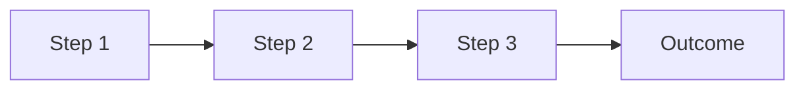
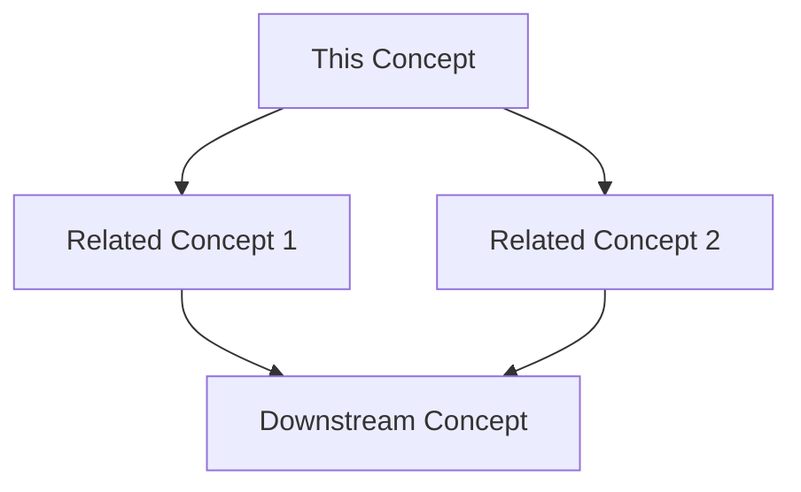

# [Concept Name]

<!--
Template: concept-template.md v1.0.0
Use for: Theoretical foundations in /docs/concepts
-->

## 1. Overview

<!--
Provide a high-level introduction to the concept.
- What is it?
- Why does it matter?
- Who should understand this?
Keep this section concise (3-5 paragraphs).
-->

[Introduce the concept and its importance]

## 2. Key Concepts

<!--
Break down the main components or principles.
Use a mindmap to show relationships.
-->

### 2.1 Conceptual Model

```mermaid
mindmap
  root(([Concept Name]))
    Principle 1
      Sub-concept A
      Sub-concept B
    Principle 2
      Sub-concept C
      Sub-concept D
    Principle 3
      Sub-concept E
```

### 2.2 [First Key Concept]

[Explain the first major concept or principle]

### 2.3 [Second Key Concept]

[Explain the second major concept or principle]

### 2.4 [Third Key Concept]

[Explain the third major concept or principle]

## 3. How It Works

<!--
Explain the mechanics or process.
Use diagrams to illustrate flow or relationships.
-->

### 3.1 Process Overview



### 3.2 Detailed Explanation

[Provide step-by-step explanation of how the concept works in practice]

## 4. Common Misconceptions

<!--
Address frequent misunderstandings.
This helps LLMs avoid common errors.
-->

| Misconception | Reality |
|---------------|---------|
| [Common wrong belief] | [Correct understanding] |
| [Another misconception] | [Accurate explanation] |

## 5. Terminology Glossary

<!--
Define all technical terms used.
This is critical for LLM comprehension.
-->

| Term | Definition |
|------|------------|
| [Term 1] | [Clear, concise definition] |
| [Term 2] | [Clear, concise definition] |
| [Term 3] | [Clear, concise definition] |

## 6. Relationship to Other Concepts

<!--
Show how this concept connects to others.
Link to related documents where applicable.
-->



- **[Related Concept 1]**: [How they relate]
- **[Related Concept 2]**: [How they relate]

## 7. Further Reading

<!--
Provide resources for deeper understanding.
Include both internal and external references.
-->

### Internal Resources

- [Link to related pattern or compendium]

### External Resources

- [Authoritative external resource]
- [Academic or industry reference]

---

## Change Log

### Version 1.0.0 - YYYY-MM-DD - Initial concept documentation
**Sources:**
- [Contributor Name]
- [AI Assistant if applicable]
