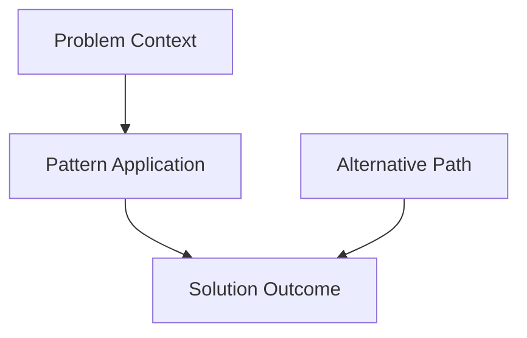
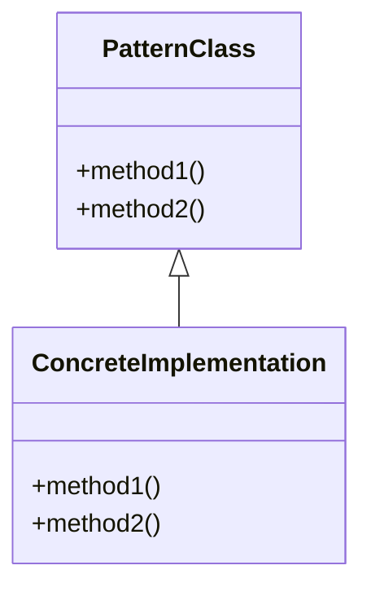

# Pattern Template

**Purpose:** This template provides a standardized structure for reusable solution patterns in `/docs/patterns/`. Use this template for design patterns, implementation templates, and solution frameworks.

---

```yaml
---
title: [Pattern Name] Pattern
purpose: [Reusable solution for [specific problem] in [context]]
audience: [[architect, developer]]  # Select appropriate roles
scope: [Pattern implementation and usage guidelines]
last_updated: YYYY-MM-DD
version: 1.0.0
keywords: [[pattern-type, problem-domain, solution-category]]
related_docs: [[path/to/related.md]]
---
```

# [Pattern Name] Pattern

## Problem Statement

[Clear description of the problem this pattern solves.]

### Context

[When and where this problem typically occurs.]

### Forces

* [Conflicting requirement or constraint 1]
* [Conflicting requirement or constraint 2]
* [Technical or business consideration]

---

## Solution Overview

[High-level description of the solution approach.]

### Solution Diagram



### Key Principles

* [Principle 1 with explanation]
* [Principle 2 with explanation]

---

## Implementation

### Structure

[Detailed structural elements of the pattern.]



### Code Example

[Language-agnostic or specific implementation example.]

```language
// Primary implementation
class PatternImplementation {
    constructor() {
        // Initialization
    }

    executePattern() {
        // Pattern logic
    }
}
```

### Configuration

[Configuration requirements and options.]

```yaml
# Example configuration
pattern:
  setting1: value1
  setting2: value2
```

---

## Usage Examples

### Example 1: [Use Case Name]

[Specific implementation example with context.]

### Example 2: [Another Use Case]

[Additional example showing variation.]

---

## Benefits

* [Benefit 1 with detailed explanation]
* [Benefit 2 with detailed explanation]
* [Benefit 3 with detailed explanation]

---

## Trade-offs and Considerations

### Advantages

* [Advantage 1]
* [Advantage 2]

### Disadvantages

* [Disadvantage 1]
* [Disadvantage 2]

### When to Use

[Conditions where this pattern is most appropriate.]

### When to Avoid

[Conditions where this pattern should not be used.]

---

## Related Patterns

### Similar Patterns

* **[Related Pattern A]** - [How it compares/differs]
* **[Related Pattern B]** - [How it compares/differs]

### Alternative Approaches

* **[Alternative 1]** - [When to consider this instead]
* **[Alternative 2]** - [When to consider this instead]

---

## Testing and Validation

### Unit Testing

[Testing approaches for the pattern.]

### Integration Testing

[Testing pattern interactions.]

### Performance Considerations

[Performance implications and testing approaches.]

---

## Anti-patterns

### Common Mistakes

**Anti-pattern: [Mistake Name]**
- **Problem:** [What goes wrong]
- **Solution:** [How to avoid it]

**Anti-pattern: [Another Mistake]**
- **Problem:** [Issue description]
- **Solution:** [Corrective approach]

---

## References

1. [Design Patterns Book] - [Original source if applicable]
2. [Related Documentation] - [Internal references]

---

## Change Log

### Version 1.0.0 - YYYY-MM-DD - Initial pattern documentation
**Sources:**
- [Your Name]
- [AI Assistant Name, if applicable]

---

*This pattern provides a proven solution for [brief restatement of problem and value].*