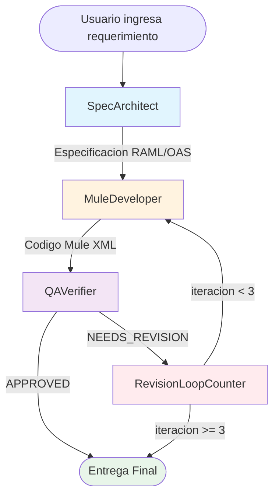
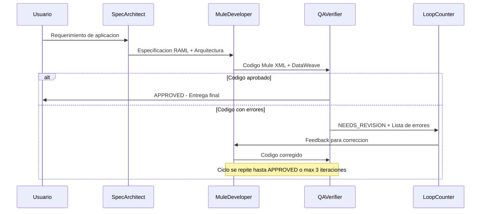

# MB_mule_app - Workflow de Generacion de Aplicaciones MuleSoft

## Descripcion General

Este workflow automatiza la creacion de aplicaciones MuleSoft siguiendo un ciclo de desarrollo completo con especificacion, implementacion y verificacion. Incluye un loop de correccion para asegurar la calidad del codigo generado.

## Diagrama del Workflow



## Nodos del Workflow

### 1. SpecArchitect (Arquitecto de Especificaciones)

**Tipo:** Agent
**Funcion:** Genera la especificacion tecnica de la API y arquitectura de la aplicacion Mule.

**Responsabilidades:**
- Crear especificacion RAML 1.0 o OAS 3.0
- Definir tipos de datos y schemas
- Diseñar arquitectura API-led (Experience, Process, System layers)
- Identificar conectores requeridos
- Establecer estrategia de manejo de errores
- Definir consideraciones de seguridad

**Output esperado:**
- Especificacion API completa en bloque de codigo
- Lista de conectores Mule necesarios
- Descripcion de la arquitectura de flujos

---

### 2. MuleDeveloper (Desarrollador Mule)

**Tipo:** Agent
**Funcion:** Implementa la aplicacion Mule basada en la especificacion recibida.

**Responsabilidades:**
- Crear archivos XML de configuracion Mule
- Escribir transformaciones DataWeave
- Configurar conectores (HTTP Listener, Database, etc.)
- Implementar manejadores de errores
- Crear archivos de propiedades
- Definir dependencias en pom.xml

**Output esperado:**
- Archivos XML de Mule 4 completos
- Scripts DataWeave
- Archivos de configuracion
- pom.xml con dependencias

---

### 3. QAVerifier (Verificador de Calidad)

**Tipo:** Agent
**Funcion:** Revisa el codigo y verifica que cumple con los estandares.

**Criterios de verificacion:**
- Sintaxis XML correcta
- Expresiones DataWeave validas
- Manejo de errores implementado
- Mejores practicas de seguridad
- Alineacion con la especificacion original
- Cumplimiento de mejores practicas Mule 4

**Output esperado:**
- `APPROVED` - Si todo esta correcto
- `NEEDS_REVISION` - Si hay errores, con lista detallada de issues

---

### 4. RevisionLoopCounter (Contador de Iteraciones)

**Tipo:** Loop Counter
**Funcion:** Limita el numero de ciclos de correccion a un maximo de 3.

**Comportamiento:**
- Si iteracion < 3: Reenvia al MuleDeveloper para correccion
- Si iteracion >= 3: Procede al nodo FINAL con la implementacion actual

---

### 5. FINAL (Nodo Final)

**Tipo:** Passthrough
**Funcion:** Nodo de salida que entrega el resultado final del workflow.

---

## Flujo de Ejecucion



## Configuracion de Edges (Conexiones)

| Origen | Destino | Condicion |
|--------|---------|-----------|
| SpecArchitect | MuleDeveloper | Siempre |
| MuleDeveloper | QAVerifier | Siempre |
| QAVerifier | FINAL | Keyword: "APPROVED" |
| QAVerifier | RevisionLoopCounter | Keyword: "NEEDS_REVISION" |
| RevisionLoopCounter | MuleDeveloper | Siempre (hasta max iteraciones) |

## Uso

1. Ir a **Launch** en ChatDev
2. Seleccionar **MB_mule_app**
3. Ingresar el requerimiento, por ejemplo:
   - "Create a REST API that integrates with Salesforce to sync contacts"
   - "Build a Mule application that exposes a CRUD API for a PostgreSQL database"
   - "Design an API that transforms XML orders to JSON and sends to a queue"

4. El workflow generara:
   - Especificacion API (RAML/OAS)
   - Codigo Mule XML completo
   - Transformaciones DataWeave
   - Archivos de configuracion

## Ejemplo de Prompt

```
Create a MuleSoft application that:
- Exposes a REST API for managing products
- Connects to a MySQL database
- Implements CRUD operations (GET, POST, PUT, DELETE)
- Includes proper error handling
- Uses API-led connectivity pattern
```

## Notas Tecnicas

- **Provider:** OpenAI-compatible (configurado para LM Studio)
- **Modelo:** gpt-4o (LM Studio lo traduce al modelo local cargado)
- **Temperature:** Baja (0.1-0.2) para codigo consistente
- **Max iterations:** 3 ciclos de correccion maximo
